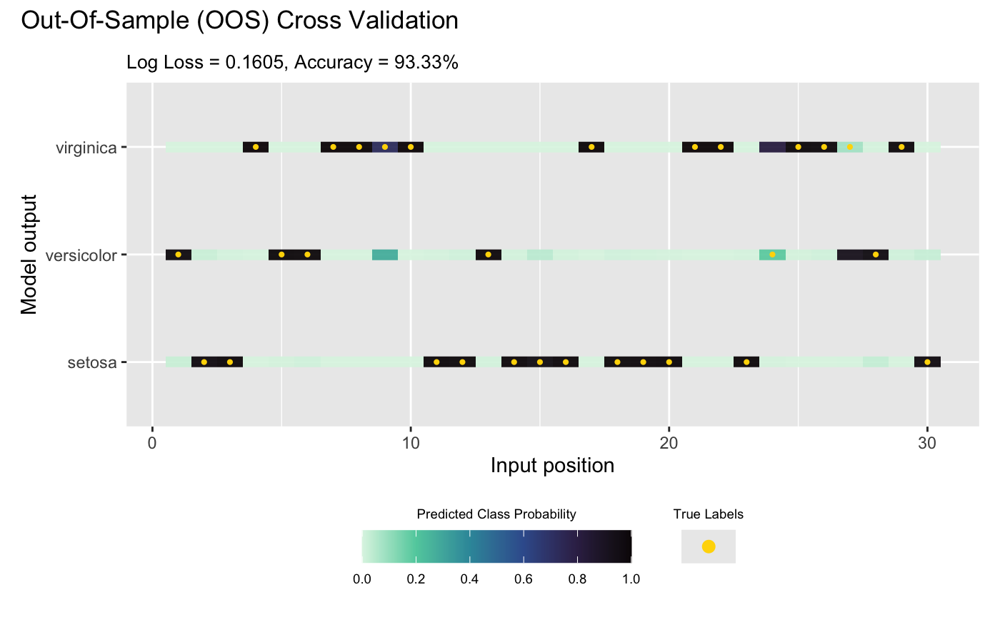
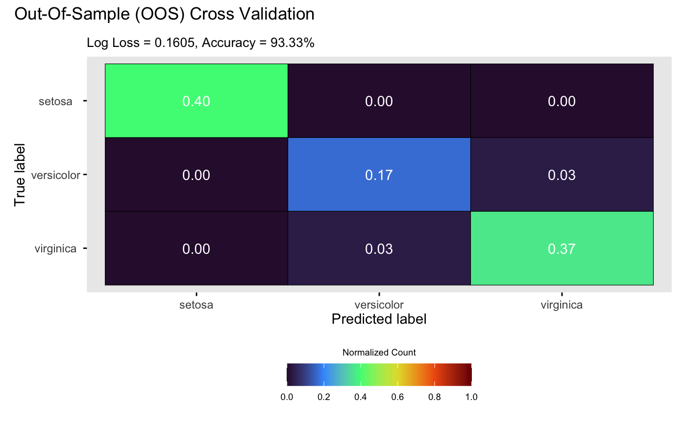

# DGP Classification

This vignette gives a demonstration of the package on classifying the
popular iris data set (Anderson 1935).

## Load packages and data

We start by loading required packages,

``` r
library(dgpsi)
library(dplyr)
```

We now load the iris data set,

``` r
data(iris)
```

and re-scale its four input variables to $\lbrack 0,1\rbrack$.

``` r
iris <- iris %>%
  mutate(across(1:4, ~ (. - min(.)) / (max(.) - min(.))))
```

Before building a classifier, we set a seed with
[`set_seed()`](http://mingdeyu.github.io/dgpsi-R/dev/reference/set_seed.md)
from the package for reproducibility

``` r
set_seed(9999)
```

and split the data into training and testing:

``` r
test_idx <- sample(seq_len(nrow(iris)), size = 30)

train_data <- iris[-test_idx, ]
test_data <- iris[test_idx, ]

X_train <- as.matrix(train_data[, 1:4])
Y_train <- as.matrix(train_data[, 5])

X_test <- as.matrix(test_data[, 1:4])
Y_test <- as.matrix(test_data[, 5])
```

## Construct and train a DGP classifier

We consider a three-layer DGP classifier using Matérn-2.5 kernels:

``` r
m_dgp <- dgp(X_train, Y_train, depth = 3, name = 'matern2.5', likelihood = "Categorical")
```

    ## Auto-generating a 3-layered DGP structure ... done
    ## Initializing the DGP emulator ... done
    ## Training the DGP emulator: 
    ## Iteration 500: Layer 3: 100%|██████████| 500/500 [00:52<00:00,  9.44it/s]
    ## Imputing ... done

Visualizing the DGP object helps to clarify the layered structure for
non-Gaussian (in this case categorical) likelihoods.

``` r
summary(m_dgp)
```

After the global inputs, the 3-layered DGP is comprised of 2 hidden
layers containing GPs, and a “likelihood layer” that transforms each of
the preceding GP nodes to one of the parameters required by the
likelihood function. In this example, we have 3 possible categories and
we use a softmax link function, so there are 3 parameters to set and the
second layer has 3 GP nodes, one for each of them.

## Validation

We are now ready to validate the classifier via
[`validate()`](http://mingdeyu.github.io/dgpsi-R/dev/reference/validate.md)
at 30 out-of-sample testing positions:

``` r
m_dgp <- validate(m_dgp, X_test, Y_test)
```

    ## Initializing the OOS ... done
    ## Calculating the OOS ... done
    ## Saving results to the slot 'oos' in the dgp object ... done

Finally, we visualize the OOS validation for the classifier:

``` r
plot(m_dgp, X_test, Y_test)
```

    ## Validating and computing ... done
    ## Post-processing OOS results ... done
    ## Plotting ... done



By default,
[`plot()`](http://mingdeyu.github.io/dgpsi-R/dev/reference/plot.md)
displays true labels against predicted label proportions at each input
position. Alternatively, setting `style = 2` in
[`plot()`](http://mingdeyu.github.io/dgpsi-R/dev/reference/plot.md)
generates a confusion matrix:

``` r
plot(m_dgp, X_test, Y_test, style = 2)
```

    ## Validating and computing ... done
    ## Post-processing OOS results ... done
    ## Plotting ... done



### References

Anderson, Edgar. 1935. “The Irises of the Gaspe Peninsula.” *Bulletin of
American Iris Society* 59: 2–5.
