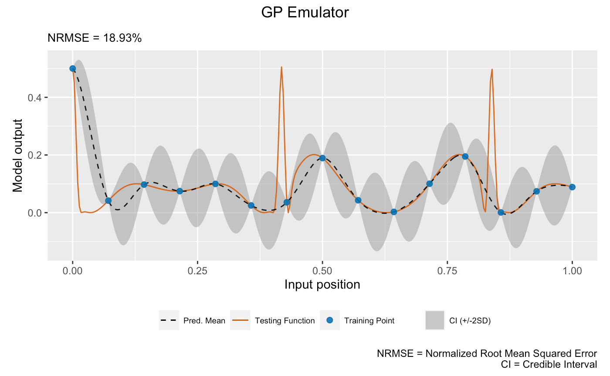
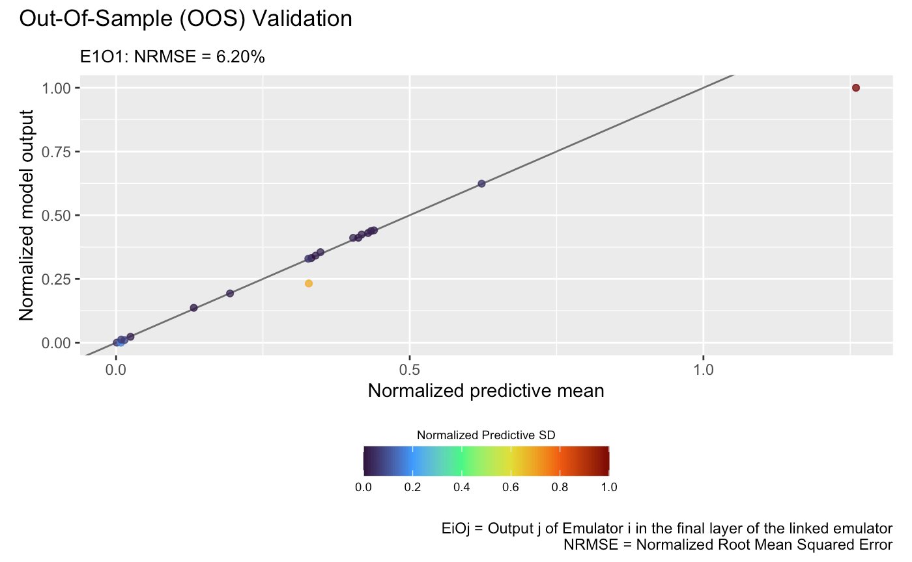

# Linked (D)GP Emulation

This vignette shows how to use the package to emulate a feed-forward
system of three synthetic computer models.

## Load the package

``` r
library(ggplot2)
library(patchwork)
library(dgpsi)
```

## Construct a synthetic system

We consider the following synthetic system


that involves three models defined by:

``` r
# Model 1
f1 <- function(x) {
  (sin(7.5*x)+1)/2
}
# Model 2
f2 <- function(x) {
  2/3*sin(2*(2*x - 1))+4/3*exp(-30*(2*(2*x-1))^2)-1/3  
}
# Model 3
f3 <- function(x) {
  x[1]*x[2]^2
}
# Linked Model 
f123 <- function(x) {
  f3(c(f1(x),f2(f1(x))))
}
```

We then specify a seed with
[`set_seed()`](http://mingdeyu.github.io/dgpsi-R/dev/reference/set_seed.md)
from the package for reproducibility

``` r
set_seed(999)
```

and generate 10 training data points for Model 1 and 15 training data
points for Model 2 and 3:

``` r
# Training data for Model 1
X1 <- seq(0, 1, length = 10)
Y1 <- sapply(X1, f1)
# Training data for Model 2
X2 <- seq(0, 1, length = 15)
Y2 <- sapply(X2, f2)
# Training data for Model 3
X3 <- cbind(X2, Y2)
Y3 <- apply(X3, f3, MARGIN = 1)
```

## Emulation of Model 1

We construct and train a GP emulator with Matérn-2.5 kernel with ID
`gp1`:

``` r
m1 <- gp(X1, Y1, name = "matern2.5", id = "gp1")
```

    ## Auto-generating a GP structure ... done
    ## Initializing the GP emulator ... done
    ## Training the GP emulator ... done

We now validate the trained GP emulator by
[`plot()`](http://mingdeyu.github.io/dgpsi-R/dev/reference/plot.md) by
LOO (alternatively, one can first use
[`validate()`](http://mingdeyu.github.io/dgpsi-R/dev/reference/validate.md)
to store the LOO results before plotting with
[`plot()`](http://mingdeyu.github.io/dgpsi-R/dev/reference/plot.md)):

``` r
plot(m1)
```

    ## Validating and computing ... done
    ## Post-processing LOO results ... done
    ## Plotting ... done


## Emulation of Model 2

We construct a two-layered DGP emulator with Matérn-2.5 kernels to
emulate Model 2:

``` r
m2 <- dgp(X2, Y2, depth = 2, name = "matern2.5")
```

    ## Auto-generating a 2-layered DGP structure ... done
    ## Initializing the DGP emulator ... done
    ## Training the DGP emulator:
    ## Iteration 500: Layer 2: 100%|██████████| 500/500 [00:01<00:00, 264.72it/s]
    ## Imputing ... done

and set its ID to `gp2` using the
[`set_id()`](http://mingdeyu.github.io/dgpsi-R/dev/reference/set_id.md)
function:

``` r
m2 <- set_id(m2, "gp2")
```

The following plot visualizes the LOO of the trained DGP emulator `m2`:

``` r
plot(m2)
```

    Validating and computing ... done
    Post-processing LOO results ... done
    Plotting ... done


## Emulation of Model 3

We now construct a three-layered DGP emulator with Matérn-2.5 kernels to
emulate Model 3:

``` r
m3 <- dgp(X3, Y3, depth = 3, name = "matern2.5", id = "gp3" )
```

    ## Auto-generating a 3-layered DGP structure ... done
    ## Initializing the DGP emulator ... done
    ## Training the DGP emulator:
    ## Iteration 500: Layer 3: 100%|██████████| 500/500 [00:04<00:00, 104.80it/s]
    ## Imputing ... done

The following plot visualizes the LOO of the trained DGP emulator `m3`:

``` r
plot(m3)
```

    Validating and computing ... done
    Post-processing LOO results ... done
    Plotting ... done


## Emulation of Linked Model

With the GP emulator `m1` (for Model 1), the DGP emulator `m2` (for
Model 2), and the DGP emulator `m3` (for Model 3) at hand, we are now
ready to build the linked emulator by first defining a data frame
`struc`:

``` r
struc <- data.frame(From_Emulator = c("Global", "gp1", "gp1", "gp2"),
                    To_Emulator = c("gp1", "gp2", "gp3", "gp3"),
                    From_Output = c(1, 1, 1, 1),
                    To_Input = c(1, 1, 1, 2))
struc
```

    ##   From_Emulator To_Emulator From_Output To_Input
    ## 1        Global         gp1           1        1
    ## 2           gp1         gp2           1        1
    ## 3           gp1         gp3           1        1
    ## 4           gp2         gp3           1        2

The `struc` data frame above defines the feed-forward connection
structure between the three emulators in the linked system. Each row
represents a one-to-one connection between an output dimension
(`From_Output`) of a source emulator (`From_Emulator`) and an input
dimension (`To_Input`) of a target emulator (`To_Emulator`).

For example: - The first row specifies that the global input (denoted by
`Global`)’s first dimension (column) is connected to the first input
dimension of emulator `gp1`. - The second row indicates that the first
output dimension of emulator `gp1` is connected to the first input
dimension of emulator `gp2`.

Finally, we can pass `struc` and a list of the three trained emulators
to [`lgp()`](http://mingdeyu.github.io/dgpsi-R/dev/reference/lgp.md) to
create the linked emulator. The order of the emulators in the list does
not matter:

``` r
emulators <- list(m1, m2, m3)
```

Before activating the linked emulator for prediction, it’s good practice
to first inspect the structure of the emulator:

``` r
m_link <- lgp(struc, emulators, activate = FALSE)
```

    Processing emulators ... done
    Linking and synchronizing emulators ... done

and visually check the relationships between emulators by applying
[`summary()`](http://mingdeyu.github.io/dgpsi-R/dev/reference/summary.md)
to `m_link`:

``` r
summary(m_link)
```

If everything looks correct, we can then activate the linked emulator
for prediction:

``` r
m_link <- lgp(struc, emulators, activate = TRUE)
```

    Processing emulators ... done
    Linking and synchronizing emulators ... done
    Activating the linked emulator ... done

For comparison, we construct a GP emulator for the whole system by
generating 15 training data points from Model 1 and Model 2:

``` r
X_gp <- seq(0, 1, length = 15)
Y_gp <- sapply(X_gp, f123)
m_gp <- gp(X_gp, Y_gp, name = 'matern2.5')
```

    ## Auto-generating a GP structure ... done
    ## Initializing the GP emulator ... done
    ## Training the GP emulator ... done

Finally, we validate both the GP emulator and the linked emulator at 300
testing data points over $\lbrack 0,1\rbrack$:

``` r
# Testing input
test_x <- seq(0, 1, length = 300)
# Testing output
test_y <- sapply(test_x, f123)
# Validate GP emulator
m_gp <- validate(m_gp, x_test = test_x, y_test = test_y, verb = F)
# Validate linked emulator
m_link <- validate(m_link, x_test = test_x, y_test = test_y, verb = F)
```

and plot them to compare their performance:

``` r
# GP emulator
plot(m_gp, x_test = test_x, y_test = test_y, type = 'line', verb = F) +
  plot_annotation(title = 'GP Emulator', theme = theme(plot.title = element_text(hjust = 0.5)))
```



``` r
# Linked emulator
plot(m_link, x_test = test_x, y_test = test_y, type = 'line', verb = F) +
  plot_annotation(title = 'Linked Emulator', theme = theme(plot.title = element_text(hjust = 0.5)))
```


We see that the linked emulator outperforms the GP emulator with
significantly better mean prediction and uncertainty quantification.

In real-life applications, we are rarely able to generate this many
testing data points from the underlying computer simulators to evaluate
the emulators over the whole input space. However, we are still able to
retain some available realizations from the computer simulators for
validation. Say we were able to afford 20 runs of the above linked
computer system:

``` r
# OOS testing input
test_x_oos <- sample(seq(0, 1, length = 300), 20)
# OOS testing output
test_y_oos <- sapply(test_x_oos, f123)
```

Then, we can conduct OOS validation for the GP emulator:

``` r
plot(m_gp, test_x_oos, test_y_oos, style = 2)
```

    ## Validating and computing ... done
    ## Post-processing OOS results ... done
    ## Plotting ... done


and the linked emulator:

``` r
plot(m_link, test_x_oos, test_y_oos, style = 2)
```

    ## Validating and computing ... done
    ## Post-processing OOS results ... done
    ## Plotting ... done



which show that the linked emulator outperforms the GP emulator with
significantly better predictive accuracy and lower NRMSE.
