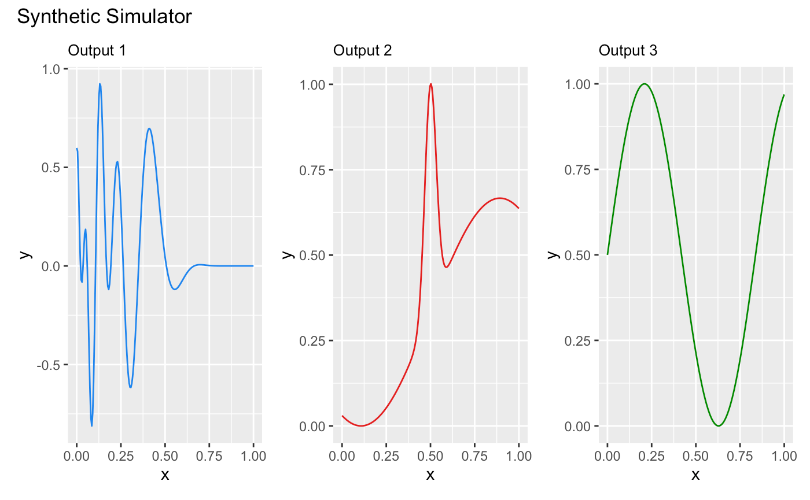
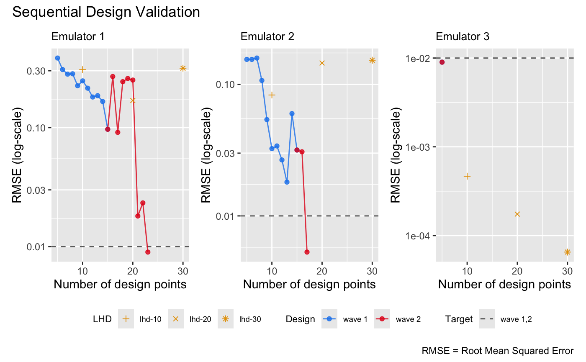

# Sequential Design II

This vignette shows how to use the package to sequentially refine a
bundle of DGP emulators, each of which emulates an output of a
simulator.

## Load the packages

``` r
library(lhs)
library(ggplot2)
library(patchwork)
library(dgpsi)
```

## Construct a synthetic simulator

We construct a synthetic simulator that has a one-dimensional input
between `[0, 1]` and a three-dimensional output.

``` r
f <- function(x) {
  y1 = sin(30*((2*x-1)/2-0.4)^5)*cos(20*((2*x-1)/2-0.4))
  y2 = 1/3*sin(2*(2*x - 1))+2/3*exp(-30*(2*(2*x-1))^2)+1/3
  y3 = (sin(7.5*x)+1)/2
  return(cbind(y1, y2, y3))
}
```

Note that the function is defined in such a way that both its input,
`x`, and output are matrices. The following figure shows the true
functional forms of the three outputs of the simulator over
$\lbrack 0,1\rbrack$:

``` r
dense_x <- seq(0, 1, length = 200)
dense_y <- f(dense_x)
output1 <- data.frame('x' = dense_x, 'y' = dense_y[,1])
output2 <- data.frame('x' = dense_x, 'y' = dense_y[,2])
output3 <- data.frame('x' = dense_x, 'y' = dense_y[,3])
p1 <- ggplot(data = output1, aes(x = x, y = y)) + geom_line(color = 'dodgerblue2') + ggtitle('Output 1') + theme(plot.title = element_text(size = 10))
p2 <- ggplot(data = output2, aes(x = x, y = y)) + geom_line(color = '#E31A1C') + ggtitle('Output 2') + theme(plot.title = element_text(size = 10))
p3 <- ggplot(data = output3, aes(x = x, y = y)) + geom_line(color = 'green4') + ggtitle('Output 3') + theme(plot.title = element_text(size = 10))
wrap_plots(list(p1, p2, p3)) + plot_annotation(title = 'Synthetic Simulator')
```



We now specify a seed with
[`set_seed()`](http://mingdeyu.github.io/dgpsi-R/dev/reference/set_seed.md)
from the package for reproducibility

``` r
set_seed(9999)
```

and generate an initial design with 5 design points using a maximin
Latin hypercube sampler:

``` r
X <- maximinLHS(5, 1)
Y <- f(X)
```

We generate a validation dataset to track and stop the sequential
design:

``` r
validate_x <- maximinLHS(200, 1)
validate_y <- f(validate_x)
```

## Construct a bundle of DGP emulators

Before we start the sequential design, we build three DGP emulators that
emulate the three outputs of the simulator `f` independently:

``` r
m1 <- dgp(X, Y[,1], connect = F)
```

    ## Auto-generating a 2-layered DGP structure ... done
    ## Initializing the DGP emulator ... done
    ## Training the DGP emulator: 
    ## Iteration 500: Layer 2: 100%|██████████| 500/500 [00:01<00:00, 335.63it/s]
    ## Imputing ... done

``` r
m2 <- dgp(X, Y[,2], connect = F)
```

    ## Auto-generating a 2-layered DGP structure ... done
    ## Initializing the DGP emulator ... done
    ## Training the DGP emulator: 
    ## Iteration 500: Layer 2: 100%|██████████| 500/500 [00:01<00:00, 294.20it/s]
    ## Imputing ... done

``` r
m3 <- dgp(X, Y[,3])
```

    ## Auto-generating a 2-layered DGP structure ... done
    ## Initializing the DGP emulator ... done
    ## Training the DGP emulator: 
    ## Iteration 500: Layer 2: 100%|██████████| 500/500 [00:01<00:00, 387.69it/s]
    ## Imputing ... done

Note that we have the global connection turned off for the first two DGP
emulators because we found that this yields better emulation
performance. We then build a bundle of the three DGP emulators using
[`pack()`](http://mingdeyu.github.io/dgpsi-R/dev/reference/pack.md):

``` r
m <- pack(m1, m2, m3)
```

## Sequential design for the emulator bundle

To begin sequential design, we first specify the limit of each input:

``` r
lim <- c(0, 1)
```

and set a target RMSE to stop the sequential design:

``` r
target <- 0.01
```

Here we choose `0.01` because it is equivalent to `1%` normalized error
given that the ranges of both outputs are `[0,1]`. We can set different
targets for different outputs, e.g., by setting
`target <- c(0.005, 0.02, 0.01)`.

We start the first-wave of the sequential design with 10 steps:

``` r
# 1st wave of the sequential design with 10 steps
m <- design(m, N = 10, limits = lim, f = f, x_test = validate_x, y_test = validate_y, target = target)
```

    ## Initializing ... done
    ##  *  RMSE: 0.383722, RMSE: 0.154689, RMSE: 0.008984
    ## Iteration 1:
    ##  - Locating ... done
    ##  * Next design point (Emulator1): 0.208133
    ##  * Next design point (Emulator2): 0.235860
    ##  * Next design point (Emulator3): None (target reached)
    ##  - Updating and re-fitting ... done
    ##  - Validating ... done
    ##  *  RMSE: 0.307165, RMSE: 0.154614, RMSE: 0.008984
    ##  
    ##  ...
    ##  
    ## Iteration 10:
    ##  - Locating ... done
    ##  * Next design point (Emulator1): 0.309109
    ##  * Next design point (Emulator2): 0.488460
    ##  * Next design point (Emulator3): None (target reached)
    ##  - Updating and re-fitting ... done
    ##  - Validating ... done
    ##  *  RMSE: 0.096814, RMSE: 0.031681, RMSE: 0.008984
    ## Targets not reached for all emulators at the end of the sequential design.

It can be seen that at the first step, the DGP emulator for the third
output has already reached the target, so no further refinements (i.e.,
additions of design points to the third DGP emulator) are performed for
the remaining steps. By the end of the first wave, the DGP emulators for
the first and second outputs have not yet reached the target. At this
point, we can proceed to a second wave by repeating the command above.
However, we demonstrate an alternative approach below, where we define
an aggregation function (applicable to all built-in `method` functions
of
[`design()`](http://mingdeyu.github.io/dgpsi-R/dev/reference/design.md)).
This function aggregates criterion scores across the three outputs,
ensuring that the same design points are added to all three emulators at
each step, instead of selecting different design points for each
emulator. Using the aggregation approach can be advantageous if the
different outputs exhibit similar behavior with respect to the input, as
it reduces number of simulations required at each iteration. However, if
the outputs behave differently, it may be more effective to add distinct
design points to each emulator to achieve lower errors more quickly.

We define the aggregation function `g` to compute a weighted average of
the scores:

``` r
g <- function(x, weight){
  x[,1] <- x[,1]*weight[1]
  x[,2] <- x[,2]*weight[2]
  x[,3] <- x[,3]*weight[3]
  return(rowSums(x))
}
```

Since the third emulator has already reached the target, we assign zero
weights to it and weights of 0.8 and 0.2 to the first and second
emulators respectively:

``` r
weight <- c(0.8, 0.2, 0)
```

We now pass both the aggregate function, `g()`, and its `weight`
argument to
[`design()`](http://mingdeyu.github.io/dgpsi-R/dev/reference/design.md)
for a second wave of the sequential design with a further 15 steps:

``` r
# 2nd wave with 15 steps
m <- design(m, N = 15, limits = lim, f = f, x_test = validate_x, y_test = validate_y, aggregate = g, target = 0.01, weight = weight)
```

    ## Initializing ... done
    ##  *  RMSE: 0.096814, RMSE: 0.031681, RMSE: 0.008984
    ## Iteration 1:
    ##  - Locating ... done
    ##  * Next design point (Emulator1): 0.063719
    ##  * Next design point (Emulator2): 0.063719
    ##  * Next design point (Emulator3): None (target reached)
    ##  - Updating and re-fitting ... done
    ##  - Validating ... done
    ##  *  RMSE: 0.268437, RMSE: 0.030712, RMSE: 0.008984
    ## Iteration 2:
    ##  - Locating ... done
    ##  * Next design point (Emulator1): 0.021174
    ##  * Next design point (Emulator2): 0.021174
    ##  * Next design point (Emulator3): None (target reached)
    ##  - Updating and re-fitting ... done
    ##  - Validating ... done
    ##  *  RMSE: 0.091204, RMSE: 0.005310, RMSE: 0.008984
    ## Iteration 3:
    ##  - Locating ... done
    ##  * Next design point (Emulator1): 0.379801
    ##  * Next design point (Emulator2): None (target reached)
    ##  * Next design point (Emulator3): None (target reached)
    ##  - Updating and re-fitting ... done
    ##  - Validating ... done
    ##  *  RMSE: 0.242991, RMSE: 0.005310, RMSE: 0.008984
    ##  
    ##  ...
    ## 
    ## Iteration 8:
    ##  - Locating ... done
    ##  * Next design point (Emulator1): 0.010541
    ##  * Next design point (Emulator2): None (target reached)
    ##  * Next design point (Emulator3): None (target reached)
    ##  - Updating and re-fitting ... done
    ##  - Validating ... done
    ##  *  RMSE: 0.009013, RMSE: 0.005310, RMSE: 0.008984
    ## Target reached! Sequential design stopped at step 8.

The first and the second emulators reached the target after iteration 8
and 2 of the second wave, respectively. The sequential design points of
the three emulators can be plotted with
[`draw()`](http://mingdeyu.github.io/dgpsi-R/dev/reference/draw.md):

``` r
draw(m, 'design')
```


The figure above shows that, for the first emulator, most of the design
points are added below 0.5, while for the second emulator, the design
points are concentrated around 0.5. For the third emulator, the
resulting design is space-filling. These design point distributions
align with the functional complexities of the three outputs. However, in
the second wave, which uses the aggregation function, additional points
are added below 0.5 for the second emulator due to the higher weight
assigned to the first emulator. These points may not be necessary for
the second output, as its functional behavior does not require further
refinement in that region. This observation aligns with the earlier
argument that using the aggregation function to add the same design
points to outputs with differing behaviors may not always be effective.

## Comparison to DGP emulators with space-filling designs

We build three independent DGP emulators for the three outputs with
static space-filling Latin hypercube designs (LHD) of size 10, 20, and
30 respectively:

``` r
# DGP emulators with a LHD of size 10
X1 <- maximinLHS(10, 1)
Y1 <- f(X1)
m11 <- dgp(X1, Y1[,1], connect = F, verb = F)
m12 <- dgp(X1, Y1[,2], connect = F, verb = F)
m13 <- dgp(X1, Y1[,3], verb = F)
```

``` r
# DGP emulator with a LHD of size 20
X2 <- maximinLHS(20, 1)
Y2 <- f(X2)
m21 <- dgp(X2, Y2[,1], connect = F, verb = F)
m22 <- dgp(X2, Y2[,2], connect = F, verb = F)
m23 <- dgp(X2, Y2[,3], verb = F)
```

``` r
# DGP emulator with a LHD of size 30
X3 <- maximinLHS(30, 1)
Y3 <- f(X3)
m31 <- dgp(X3, Y3[,1], connect = F, verb = F)
m32 <- dgp(X3, Y3[,2], connect = F, verb = F)
m33 <- dgp(X3, Y3[,3], verb = F)
```

We then extract their RMSEs

``` r
# validations of the first DGP emulator
m11 <- validate(m11, x_test = validate_x, y_test = validate_y[,1], verb = F)
m21 <- validate(m21, x_test = validate_x, y_test = validate_y[,1], verb = F)
m31 <- validate(m31, x_test = validate_x, y_test = validate_y[,1], verb = F)
rmse_static_1 <- data.frame('N' = c(10, 20, 30), 'rmse' = c(m11$oos$rmse, m21$oos$rmse, m31$oos$rmse), 'LHD' = c('lhd-10', 'lhd-20', 'lhd-30'))
# validations of the second DGP emulator
m12 <- validate(m12, x_test = validate_x, y_test = validate_y[,2], verb = F)
m22 <- validate(m22, x_test = validate_x, y_test = validate_y[,2], verb = F)
m32 <- validate(m32, x_test = validate_x, y_test = validate_y[,2], verb = F)
rmse_static_2 <- data.frame('N' = c(10, 20, 30), 'rmse' = c(m12$oos$rmse, m22$oos$rmse, m32$oos$rmse), 'LHD' = c('lhd-10', 'lhd-20', 'lhd-30'))
# # validations of the third DGP emulator
m13 <- validate(m13, x_test = validate_x, y_test = validate_y[,3], verb = F)
m23 <- validate(m23, x_test = validate_x, y_test = validate_y[,3], verb = F)
m33 <- validate(m33, x_test = validate_x, y_test = validate_y[,3], verb = F)
rmse_static_3 <- data.frame('N' = c(10, 20, 30), 'rmse' = c(m13$oos$rmse, m23$oos$rmse, m33$oos$rmse), 'LHD' = c('lhd-10', 'lhd-20', 'lhd-30'))
```

and add them to the sequential design validation plot (in log-scale) for
comparison:

``` r
p <- draw(m, type = 'rmse', log = T) 
p[[1]] <- p[[1]] + 
  geom_point(data = rmse_static_1, mapping = aes(x = N, y = rmse, group = LHD, shape = LHD), color = '#E69F00', size = 1.5) +
  scale_shape_manual(values = c(3, 4, 8))
p[[2]] <- p[[2]] +
  geom_point(data = rmse_static_2, mapping = aes(x = N, y = rmse, group = LHD, shape = LHD), color = '#E69F00', size = 1.5) +
  scale_shape_manual(values = c(3, 4, 8))
p[[3]] <- p[[3]] +
  geom_point(data = rmse_static_3, mapping = aes(x = N, y = rmse, group = LHD, shape = LHD), color = '#E69F00', size = 1.5) +
  scale_shape_manual(values = c(3, 4, 8))
p
```



It can be seen from the plot above that sequential design is more
efficient than batch space-filling design, achieving similar RMSE with
fat fewer design points, particularly for the first emulator in the
bundle.

### See also

See [Sequential Design
I](https://mingdeyu.github.io/dgpsi-R/dev/articles/seq_design.html) for
the sequential design and automatic structure simplification of a DGP
emulator on a 2D simulator.
