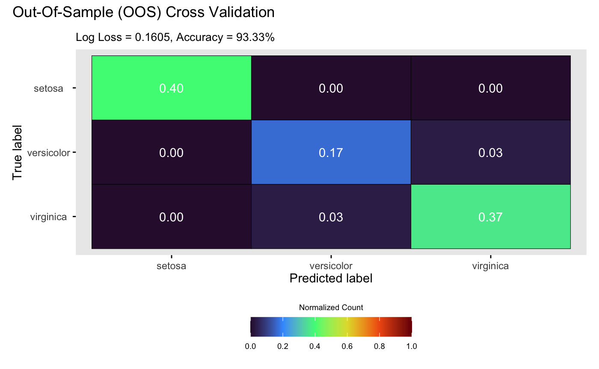

```{r setup, include = FALSE}
knitr::opts_chunk$set(
  echo = TRUE,
  eval = FALSE
)
```

This vignette gives a demonstration of the package on classifying the popular iris data set [@anderson1935irises].

## Load packages and data

We start by loading required packages,

```{r}
library(dgpsi)
library(dplyr)
```

We now load the iris data set,

```{r}
data(iris)
```

do a min-max normalization on its four input variables.

```{r}
iris <- iris %>%
  mutate(across(1:4, ~ (. - min(.)) / (max(.) - min(.))))
```

Before building a classifier, we set a seed with `set_seed()` from the package for reproducibility

```{r}
set_seed(9999)
```

and split a training data set and a testing data set:

```{r}
test_idx <- sample(seq_len(nrow(iris)), size = 30)

train_data <- iris[-test_idx, ]
test_data <- iris[test_idx, ]

X_train <- as.matrix(train_data[, 1:4])
Y_train <- as.matrix(train_data[, 5])

X_test <- as.matrix(test_data[, 1:4])
Y_test <- as.matrix(test_data[, 5])
```

## Construct and train a DGP classifier

We consider a three-layer DGP classifier, using a Matérn-2.5 kernel in the first layer and a squared exponential kernel in the second layer:

```{r}
m_dgp <- dgp(X_train, Y_train, depth = 3, name = c('matern2.5', 'sexp'), likelihood = "Categorical")
```

```
## Auto-generating a 3-layered DGP structure ... done
## Initializing the DGP emulator ... done
## Training the DGP emulator: 
## Iteration 500: Layer 3: 100%|██████████| 500/500 [00:31<00:00, 15.63it/s]
## Imputing ... done
```

We set `likelihood = "Categorical"` since the DGP classifier is essentially a DGP emulator with a categorical likelihood.

## Validation

We are now ready to validate the classifier via `validate()` at 30 out-of-sample testing positions:

```{r}
m_dgp <- validate(m_dgp, X_test, Y_test)
```

```
## Initializing the OOS ... done
## Calculating the OOS ... done
## Saving results to the slot 'oos' in the dgp object ... done
```

Finally, we visualize the OOS validation for the classifier:

```{r}
plot(m_dgp, X_test, Y_test)
```

```
## Validating and computing ... done
## Post-processing OOS results ... done
## Plotting ... done
```

{width=90%}

By default, `plot()` displays true labels against predicted label proportions at each input position. Alternatively, setting `style = 2` in `plot()` generates a confusion matrix:

```{r}
plot(m_dgp, X_test, Y_test, style = 2)
```

```
## Validating and computing ... done
## Post-processing OOS results ... done
## Plotting ... done
```

{width=90%}

### References

