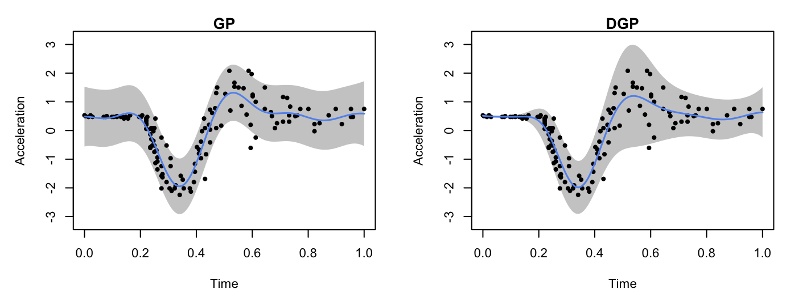

```{r setup, include = FALSE}
knitr::opts_chunk$set(
  echo = TRUE,
  eval = FALSE
)
```

In this guide we give a quick demonstration of the package on modelling the popular motorcycle dataset [@silverman1985]. There are other examples showing the functionality of the package in `articles/`, and a comprehensive Reference of functions available in `reference/`. 

## Load packages and data

We start by first loading the package and setting up the required Python environment via `init_py()` 

```{r}
library(dgpsi)
library(MASS)
init_py()
```

`init_py()` provides an automatic Python environment setup and initialization routine and must be run every time after the package is loaded. We then load the training data points,

```{r}
X <- mcycle$times
Y <- mcycle$accel
```

scale them,

```{r}
X <- as.matrix((X - min(X))/(max(X)-min(X)))
Y <- as.matrix(scale(Y, center = TRUE, scale = TRUE))
```

and plot them:

```{r}
plot(X, Y, pch = 16, cex = 1, xlab = 'Time', ylab = 'Acceleration', cex.axis = 1.3, cex.lab = 1.3)
```


## Construct the DGP structure 

We consider a three-layered DGP structure:

```{r}
layer1 <- c(kernel(length = c(0.5), name = 'sexp'))
layer2 <- c(kernel(length = c(0.2), name = 'sexp', scale_est = TRUE, connect = c(1)),
            kernel(length = c(0.2), name = 'sexp', scale_est = TRUE, connect = c(1)))
layer3 <- c(Hetero())
all_layer <- combine(layer1, layer2, layer3)
m <- dgp(X, Y, all_layer)
```

The first layer of the DGP contains a single GP node produced by `kernel()` using the squared exponential kernel with the length-scale being 0.5. The second layer contains two GP nodes, both of which have squared exponential kernel with the length-scale being 0.2. We switch on the estimation of prior variances of these two GPs because they model the mean and variance of the heteroskedastic Gaussian likelihood node in the final layer. We choose a heteroskedastic likelihood node since the data above show varying noises.

The constructed DGP structure is stored in `m` and we can use `summary()` to view the key information specified for the DGP structure:

```{r}
summary(m)
```

```
## +-----------+----------+---------------------+-----------------+---------------+-------------------+------------+-------------------+
## | Layer No. | Node No. |        Type         | Length-scale(s) |   Variance    |      Nugget       | Input Dims | Global Connection |
## +-----------+----------+---------------------+-----------------+---------------+-------------------+------------+-------------------+
## |  Layer 1  |  Node 1  |  GP (Squared-Exp)   |     [0.500]     | 1.000 (fixed) | 1.000e-06 (fixed) |    [1]     |        No         |
## |  Layer 2  |  Node 1  |  GP (Squared-Exp)   |     [0.200]     |     1.000     | 1.000e-06 (fixed) |    [1]     |        [1]        |
## |  Layer 2  |  Node 2  |  GP (Squared-Exp)   |     [0.200]     |     1.000     | 1.000e-06 (fixed) |    [1]     |        [1]        |
## |  Layer 3  |  Node 1  | Likelihood (Hetero) |       NA        |      NA       |        NA         |   [1, 2]   |        NA         |
## +-----------+----------+---------------------+-----------------+---------------+-------------------+------------+-------------------+
## 1. 'Input Dims' presents the indices of GP nodes in the feeding layer whose outputs are used as the input to the current GP.
## 2. 'Global Connection' indicates the dimensions (i.e., column numbers) of the global input data that are used as additional input dimensions to the current GP.
```

For comparison, we also construct a simple GP model (by `gp()`) which incorporates homogeneous noises:

```{r}
gp_node <- kernel(length = c(0.5), name = 'sexp', nugget = 1e-2, nugget_est = T, scale_est = T)
m_gp <- gp(X, Y, gp_node)
```

Note that we have nugget estimation switched on to account for the noises. The summary of the constructed GP model is given by

```{r}
summary(m_gp)
```

```
## +-------------+-----------------+----------+--------+------------+
## | Kernel Fun  | Length-scale(s) | Variance | Nugget | Input Dims |
## +-------------+-----------------+----------+--------+------------+
## | Squared-Exp |     [0.500]     |  1.000   | 0.010  |    [1]     |
## +-------------+-----------------+----------+--------+------------+
## 'Input Dims' indicates the dimensions (i.e., columns) of your input data that are actually used for GP training.
```

## Training and prediction

We now are able to train the constructed DGP and GP models: 

```{r}
m_trained <- train(m) # training of DGP
m_gp_trained <- train(m_gp) # training of GP
```

```
## Iteration 500: Layer 3: 100%|██████████| 500/500 [00:20<00:00, 24.80it/s]
```

For DGP model, we need to construct a separate emulator through `estimate()` and `emulator()` for predictions:

```{r}
trained_struc=estimate(m_trained)
emu <- emulator(trained_struc)
```

Before we make predictions, we can summarize the trained GP:

```{r}
summary(m_gp_trained)
```

```
## +-------------+-----------------+----------+--------+------------+
## | Kernel Fun  | Length-scale(s) | Variance | Nugget | Input Dims |
## +-------------+-----------------+----------+--------+------------+
## | Squared-Exp |     [0.132]     |  0.780   | 0.282  |    [1]     |
## +-------------+-----------------+----------+--------+------------+
## 'Input Dims' indicates the dimensions (i.e., columns) of your input data that are actually used for GP training.
```

and DGP:

```{r}
summary(emu)
```

```
## +-----------+----------+---------------------+-----------------+---------------+-------------------+------------+-------------------+
## | Layer No. | Node No. |        Type         | Length-scale(s) |   Variance    |      Nugget       | Input Dims | Global Connection |
## +-----------+----------+---------------------+-----------------+---------------+-------------------+------------+-------------------+
## |  Layer 1  |  Node 1  |  GP (Squared-Exp)   |     [0.890]     | 1.000 (fixed) | 1.000e-06 (fixed) |    [1]     |        No         |
## |  Layer 2  |  Node 1  |  GP (Squared-Exp)   |     [0.530]     |     0.797     | 1.000e-06 (fixed) |    [1]     |        [1]        |
## |  Layer 2  |  Node 2  |  GP (Squared-Exp)   |     [0.848]     |    26.668     | 1.000e-06 (fixed) |    [1]     |        [1]        |
## |  Layer 3  |  Node 1  | Likelihood (Hetero) |       NA        |      NA       |        NA         |   [1, 2]   |        NA         |
## +-----------+----------+---------------------+-----------------+---------------+-------------------+------------+-------------------+
## 1. 'Input Dims' presents the indices of GP nodes in the feeding layer whose outputs are used as the input to the current GP.
## 2. 'Global Connection' indicates the dimensions (i.e., column numbers) of the global input data that are used as additional input dimensions to the current GP.
```

We are now ready to make predictions from both models via `predict()` at 200 testing positions over $[0,1]$:

```{r}
test_x <- as.matrix(seq(0, 1, length = 200))
res_dgp <- predict(emu, x = test_x)
res_gp <- predict(m_gp_trained, x = test_x)
```

Finally, we plot the predictions from both models to check their emulation performance:

```{r}
# extract predictive means and variances from DGP
mu_dgp <- res_dgp$mean # predictive means
sd_dgp <- sqrt(res_dgp$var) # predictive variances and compute predictive standard deviations
up_dgp <- mu_dgp + 2*sd_dgp # predictive upper bound
lo_dgp <- mu_dgp - 2*sd_dgp # predictive lower bound

# extract predictive means and variances from GP
mu_gp <- res_gp$mean
sd_gp <- sqrt(res_gp$var)
up_gp <- mu_gp + 2*sd_gp
lo_gp <- mu_gp - 2*sd_gp

par(cex=0.7, mar = c(5, 5, 0.9, 0.9)+0.2)
#GP
par(fig = c(0, 0.5, 0.2, 0.8))
plot(test_x, mu_gp, type = 'l', lwd = 1.5, col = 'cornflowerblue', main = "GP", xlab = 'Time', ylab = 'Acceleration', ylim = c(-3.2,3.2))
polygon(c(test_x, rev(test_x)),c(up_gp, rev(lo_gp)), col = 'grey80', border = F)
lines(X,Y,type='p',pch = 16, cex = 0.8)
lines(test_x, mu_gp, type = 'l', lwd = 1.5, col = 'cornflowerblue')
#DGP
par(fig = c(0.5, 1, 0.2, 0.8), new = TRUE)
plot(test_x, mu_dgp, type = 'l', lwd = 1.5, col = 'cornflowerblue', main = "DGP", xlab = 'Time', ylab = 'Acceleration', ylim = c(-3.2,3.2))
polygon(c(test_x, rev(test_x)),c(up_dgp, rev(lo_dgp)), col = 'grey80', border = F)
lines(X,Y,type='p',pch = 16, cex = 0.8)
lines(test_x, mu_dgp, type = 'l', lwd = 1.5, col = 'cornflowerblue')
```



