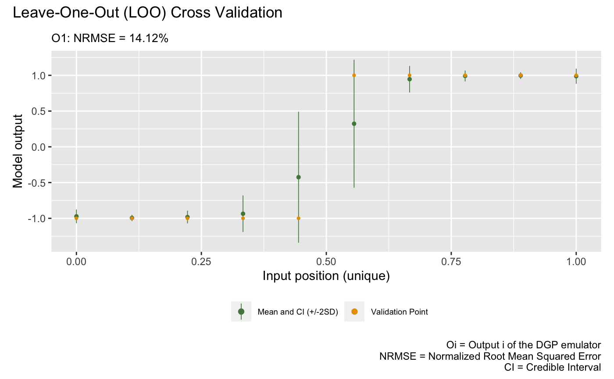
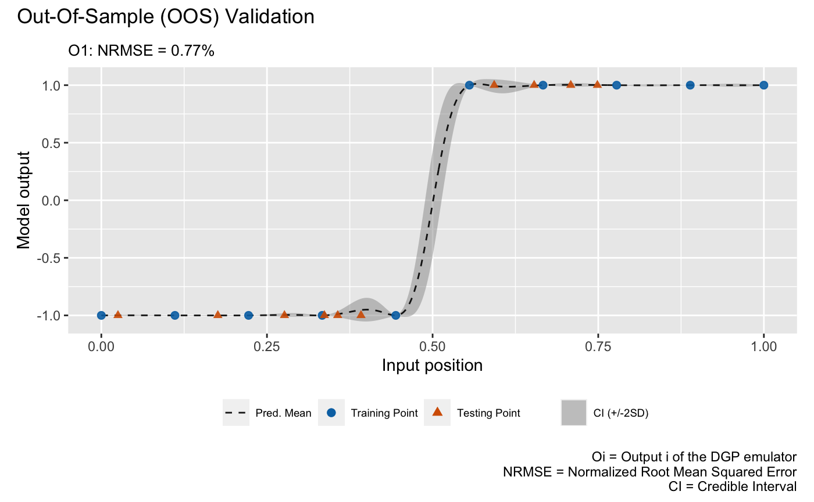
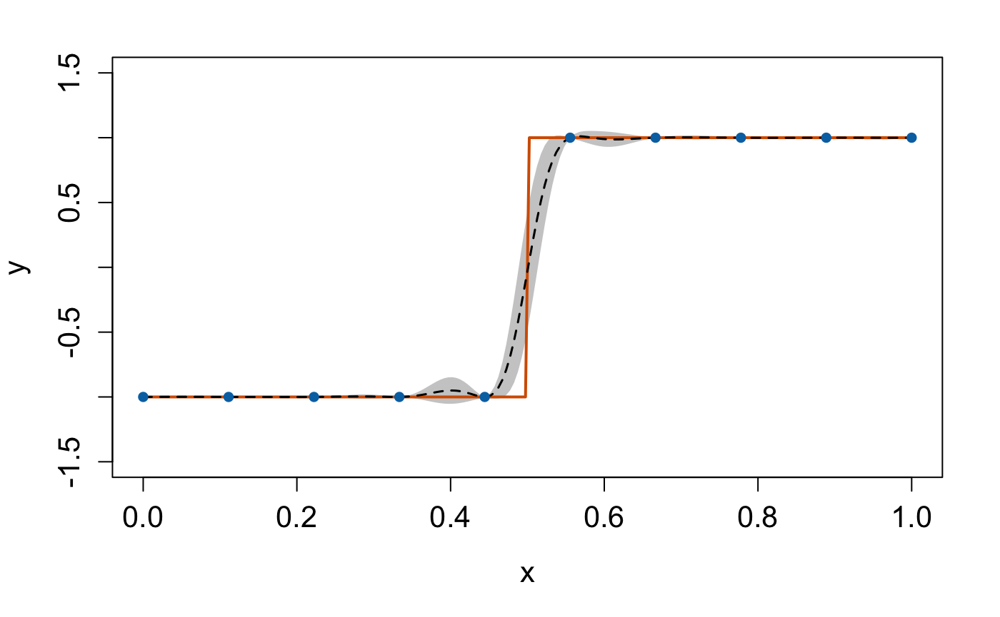

```{r setup, include = FALSE}
knitr::opts_chunk$set(
  echo = TRUE,
  eval = FALSE
)
```

`dgpsi` provides a flexible toolbox for Gaussian process (GP), deep Gaussian process (DGP) and linked (D)GP emulations. In this guide, we show how to use the package to emulate a step function with a three-layered DGP structure. There are other examples showing the functionality of the package in [`Articles`](https://mingdeyu.github.io/dgpsi-R/articles/index.html) on the package website, and how to customize a DGP structure. A comprehensive reference of available functions is documented in [`Reference`](https://mingdeyu.github.io/dgpsi-R/reference/index.html) section of the package website. 

## Load the package

`dgpsi` in R provides an initialization function `init_py()` that helps us set up and initialize the required Python environment automatically. We just need to run `init_py()` every time after the package is loaded to initiate the underlying Python environment.

```{r}
library(dgpsi)
init_py()
```

```
## Connecting to Python ... done
## Importing required Python modules ... done
## The Python environment for 'dgpsi' is successfully loaded.
```

## Set up the step function

We first specify a seed with `set_seed()` from the package for reproducibility

```{r}
set_seed(999)
```

and define the step function:

```{r}
f <- function(x) {
  if (x < 0.5) return(-1)
  if (x >= 0.5) return(1)
}
```

Then we generate ten training data points:

```{r}
X <- seq(0, 1, length = 10)
Y <- sapply(X, f)
```

## Training

We now build and train a DGP emulator with three layers:

```{r}
m <- dgp(X, Y, depth = 3)
```

```
## Auto-generating a 3-layered DGP structure ... done
## Initializing the DGP emulator ... done
## Training the DGP emulator: 
## Iteration 500: Layer 3: 100%|██████████| 500/500 [00:03<00:00, 143.03it/s]
## Imputing ... done
```

The progress bar displayed shows how long it takes to finish the training. We are able to switch off the progress bar and the trace information by setting `verb = FALSE`. Note that if we want to train the DGP emulator `m` for additional iterations, we can simply do `m <- continue(m)` instead of rebuilding the DGP emulator.

The trained DGP emulator can be viewed using the `summary()` function:

```{r}
summary(m)
```

```
## +-----------+----------+------------------+-----------------+---------------+-------------------+------------+-------------------+
## | Layer No. | Node No. |       Type       | Length-scale(s) |   Variance    |      Nugget       | Input Dims | Global Connection |
## +-----------+----------+------------------+-----------------+---------------+-------------------+------------+-------------------+
## |  Layer 1  |  Node 1  | GP (Squared-Exp) |     [0.322]     | 1.000 (fixed) | 1.000e-06 (fixed) |    [1]     |        No         |
## |  Layer 2  |  Node 1  | GP (Squared-Exp) |     [1.290]     | 1.000 (fixed) | 1.000e-06 (fixed) |    [1]     |        [1]        |
## |  Layer 3  |  Node 1  | GP (Squared-Exp) |     [2.682]     |     0.482     | 1.000e-06 (fixed) |    [1]     |        [1]        |
## +-----------+----------+------------------+-----------------+---------------+-------------------+------------+-------------------+
## 1. 'Input Dims' presents the indices of GP nodes in the feeding layer whose outputs feed into the GP node referred by 'Layer No.' and 'Node No.'.
## 2. 'Global Connection' indicates the dimensions (i.e., column indices) of the global input data that are used as additional input dimensions to the GP node referred by 'Layer No.' and 'Node No.'.
```

The summary table gives key information about the trained DGP emulator. Note that in the auto-generated emulator we have nugget terms fixed to `1e-6` for all GP nodes because we are emulating a deterministic step function (i.e., we would like our emulator to interpolate training data points). The prior scales (i.e., variances) for GP nodes in the first and second layers are fixed to `1.0` while that for the GP node in the final layer is estimated due to its attachment to the output. For further information on how to change the default settings to construct and train a DGP emulator, see `?dgp`.

At this point, you could use `write()` to save the emulator `m` to a local file and then load it using `read()` when you would like to make predictions from the emulator, e.g., on another laptop that also has the package installed.

## Validation

After we have the emulator, we can validate it by drawing the validation plots. There are two types of validation plots provided by the package. The first one is the Leave-One-Out (LOO) cross validation plot:

```{r}
plot(m)
```

```
## Initializing ... done
## Post-processing LOO results ... done
## Plotting ... done
```

 

The second validation plot is the Out-Of-Sample (OOS) validation plot that requires an out-of-sample testing data set. Here we generate an OOS data set that contains 10 testing data points

```{r}
oos_x <- sample(seq(0, 1, length = 200), 10)
oos_y <- sapply(oos_x, f)
```

for the validation:

```{r}
plot(m,oos_x,oos_y)
```

```
## Initializing ... done
## Post-processing OOS results ... done
## Plotting ... done
```

 

## Prediction

Once the validation is done, we can make predictions from the DGP emulator. We generate 200 data points from the step function over $[0,1]$

```{r}
test_x <- seq(0, 1, length = 200)
test_y <- sapply(test_x, f)
```

for predictions:

```{r}
m <- predict(m, x = test_x)
```

The `predict()` function returns an updated DGP emulator `m` that contains a slot named `results` that gives the posterior predictive means and variances at testing positions. We can extract these information and plot the emulation results to check the predictive performance of our constructed DGP emulator:

```{r}
mu <- m$results$mean # extract the predictive means 
sd <- sqrt(m$results$var) # extract the predictive variance and compute the predictive standard deviations
# compute predictive bounds which are two predictive standard deviations above and below the predictive means
up <- mu + 2*sd 
lo <- mu - 2*sd

plot(test_x, mu, type = 'l', lty = 2, lwd = 1.5, col = 'black', xlab = 'x', cex.axis = 1.3, cex.lab = 1.3, ylab = 'y', ylim = c(-1.5,1.5))  # predictive means 
polygon(c(test_x, rev(test_x)), c(up,rev(lo)), col = 'grey80', border = F) # credible interval
lines(test_x, test_y, type = 'l', col = "#D55E00", lwd = 2) # Underlying truth
lines(test_x, mu, type = 'l', lty = 2, lwd = 1.5, col = 'black')
lines(X, Y, type = 'p', pch = 16, cex = 1, col = "#0072B2") # Training data points
```

 
