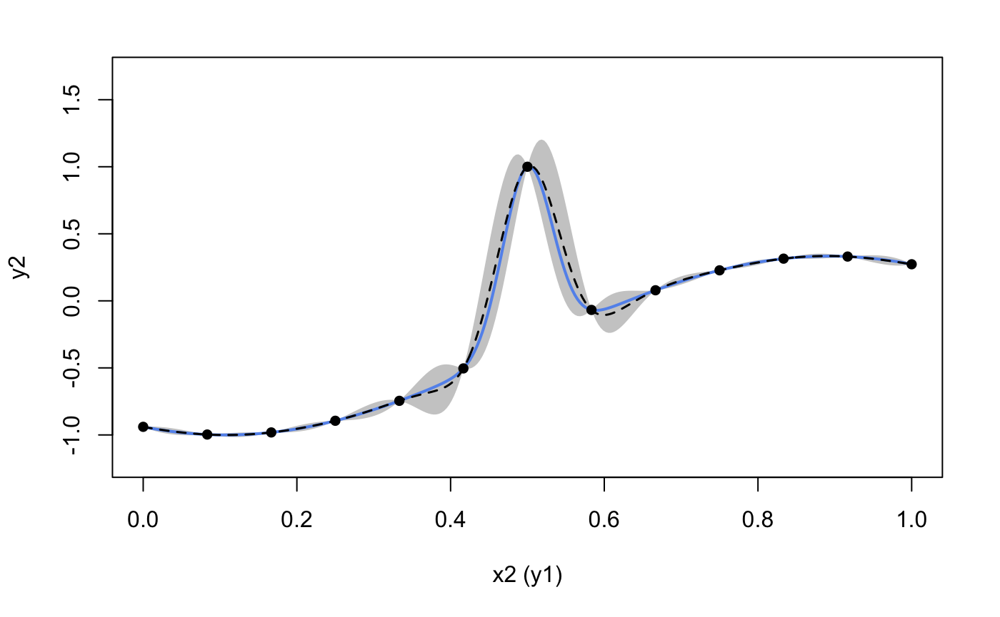

```{r setup, include = FALSE}
knitr::opts_chunk$set(
  echo = TRUE,
  eval = FALSE
)
```

This vignette shows how to use the package to emulate a feed-forward system of two synthetic computer models.

## Load the package

```{r}
library(dgpsi)
init_py()
```

## Construct two synthetic models and their linked model

We first define the functional forms of the two synthetic models and their linked model:

```{r}
# Model 1
f1 <- function(x) {
  (sin(7.5*x)+1)/2
}
# Model 2
f2 <- function(x) {
  2/3*sin(2*(2*x - 1))+4/3*exp(-30*(2*(2*x-1))^2)-1/3  
}
# Linked Model 
f12 <- function(x) {
  f2(f1(x))
}
```

We then generate 9 training data points for Model 1 and 13 training data points for Model 2:

```{r}
# Model 1
X1 <- as.matrix(seq(0, 1, length = 9))
Y1 <- as.matrix(sapply(X1, f1))
# Model 2
X2 <- as.matrix(seq(0, 1, length = 13))
Y2 <- as.matrix(sapply(X2, f2))
```

We also generate 300 testing data points over $[0,1]$:

```{r}
# Model 1
test_x1 <- as.matrix(seq(0, 1, length = 300))
test_y1 <- as.matrix(sapply(test_x1, f1))
# Model 2
test_x2 <- as.matrix(seq(0, 1, length = 300))
test_y2 <- as.matrix(sapply(test_x2, f2))
# Linked Model
test_y <- as.matrix(sapply(test_x1, f12))
```

## Emulation of Model 1

We construct a simple GP model with Matérn-2.5 kernel with length-scale initialized at 1.0:

```{r}
m1 <- gp(X1, Y1, kernel(length = c(1.0), name = 'matern2.5', scale_est = TRUE))
```

We now train the GP model:

```{r}
m1_trained <- train(m1)
```

and make predictions from the trained model to evaluate the emulation performance for Model 1 over $[0,1]$:

```{r}
res1 <- predict(m1_trained, x = test_x1)

mu1 <- res1$mean # predictive mean
sd1 <- sqrt(res1$var) # predictive standard deviations
up1 <- mu1 + 2*sd1 # predictive upper bound
lo1 <- mu1 - 2*sd1 # predictive lower bound

plot(test_x1, mu1, type = 'l', lty = 2, lwd = 1.5, col = 'black', xlab = 'x1', cex.axis = 1, cex.lab = 1, ylab = 'y1 (x2)', ylim = c(-0.2,1.2))  # predictive means 
polygon(c(test_x1, rev(test_x1)), c(up1,rev(lo1)), col = 'grey80', border = F) # predictive bounds
lines(test_x1, test_y1, type = 'l', col = 'cornflowerblue', lwd = 2) # Underlying truth
lines(test_x1, mu1, type = 'l', lty = 2, lwd = 1.5, col = 'black')
lines(X1, Y1, type = 'p', pch = 16, cex = 1) # Training data points
```


The emulation performance of GP looks good so we now export (by `export()`) the GP node contained in the GP model to a contained (via `container()`) for later use in linked emulator construction:

```{r}
c1 <- container(export(m1), c(1))
```

Note that we need to explicitly inform `container()` which columns of output matrix (from the feeding layer) that GP emulator of Model 1 will use as its input. Since the input to the GP emulator of Model 1 is the global input and all global input (which is a column vector) feeds into Model 1, the column indices that we provide to `container()` is `1`.

## Emulation of Model 2

We construct a two-layered DGP model with Matérn-2.5 kernels to emulate the Model 2:

```{r}
layer1 <- c(kernel(length = c(1.), name = 'matern2.5'))
layer2 <- c(kernel(length = c(1.), name = 'matern2.5', scale_est = TRUE))
all_layer <- combine(layer1, layer2)
m2 <- dgp(X2, Y2, all_layer)
```

The training of the DGP model is taken care by `train()`:

```{r}
m2_trained <- train(m2)
```

```
## Iteration 500: Layer 2: 100%|██████████| 500/500 [00:03<00:00, 163.72it/s]
```

We then use `estimate()` and `emulator()` to build the DGP emulator from the trained DGP model `m2_trained`:

```{r}
# construct emulator
trained_struc <- estimate(m2_trained)
emu <- emulator(trained_struc)
```

The following plot visualizes the emulation performance of the DGP emulator:

```{r}
# make predictions
res2 <- predict(emu, x = test_x2)

mu2 <- res2$mean
sd2 <- sqrt(res2$var)
up2 <- mu2 + 2*sd2
lo2 <- mu2 - 2*sd2

plot(test_x2, mu2, type = 'l', lty = 2, lwd = 1.5, col = 'black', xlab = 'x2 (y1)', cex.axis = 1, cex.lab = 1, ylab = 'y2', ylim = c(-1.2,1.7))  # predictive means 
polygon(c(test_x2, rev(test_x2)), c(up2, rev(lo2)), col = 'grey80', border = F) # predictive bounds
lines(test_x2, test_y2, type = 'l', col = 'cornflowerblue', lwd = 2) # underlying truth
lines(test_x2, mu2, type = 'l', lty = 2, lwd = 1.5, col = 'black')
lines(X2, Y2, type = 'p', pch = 16, cex = 1) # training data points
```



The DGP emulation of the Model 2 looks good as well and so we can export it (the objective produced by `estimate()`) to `container()` for later use.

```{r}
c2 <- container(trained_struc, c(1))
```

Note that this DGP emulator absorbs all output produced by the feeding layer (which only contains the GP emulator of Model 1). Since the output from the feeding layer (i.e., layer 1) is a column vector, the column indices that we need to inform the container of our DGP emulator is `c(1)`.

## Emulation of Model 1 + Model 2

With the containers `c1` (for Model 1) and `c2` (for Model 2) at hand, we are now ready to build the linked emulator by first using `combine()` to construct the system hierarchy `struc` and then applying `lgp()` for the linked emulator.  

```{r}
struc <- combine(c(c1), c(c2))
lm <- lgp(struc)
```

Note that each layer of a computer model system is represented by a list. In our case, there is one GP emulator in the first layer and a DGP emulator in the second layer. Therefore, we need to put there corresponding containers in the list using `c()` or `list()`.

We can check the relations between connected emulators by using `summary()` on `lm`:

```{r}
summary(lm)
```

```
## +-----------+--------------+------+----------------------------+-----------------+
## | Layer No. | Emulator No. | Type |         Connection         | External Inputs |
## +-----------+--------------+------+----------------------------+-----------------+
## |  Layer 1  |    Emu 1     |  GP  |     Global input: [1]      |       No        |
## |  Layer 2  |    Emu 1     | DGP  | Emu 1 in Layer 1: output 1 |       No        |
## +-----------+--------------+------+----------------------------+-----------------+
## 1. 'Connection' gives the indices of emulators and the associated output dimensions that are linked to the current emulator.
## 2. 'External Inputs' indicates if the current emulator has external inputs that are not provided by the feeding emulators.
```

For comparison, we construct a GP emulator for the whole system by generating 13 training data points from Model 1 and Model 2:

```{r}
X_gp <- as.matrix(seq(0, 1, length = 13))
Y_gp <- as.matrix(sapply(X_gp, f12))
m_gp <- gp(X_gp, Y_gp, kernel(length = c(1.0), name = 'matern2.5', scale_est = TRUE))
m_gp_trained <- train(m_gp)
```

In this final step, we make predictions from both the GP emulator and the linked emulator:

```{r}
# linked emulator
res <- predict(lm, x = test_x1)
# GP emulator
res_gp <- predict(m_gp_trained, x = test_x1)
```

and plot the predictions to compare their emulation performances:

```{r}
# extract predictive means and variances from the linked emulator
mu <- res$mean$emulator1
sd <- sqrt(res$var$emulator1)
up <- mu + 2*sd
lo <- mu - 2*sd

# extract predictive means and variances from the GP emulator
mu_gp <- res_gp$mean
sd_gp <- sqrt(res_gp$var)
up_gp <- mu_gp + 2*sd_gp
lo_gp <- mu_gp - 2*sd_gp

par(cex=0.7, mar = c(5, 5, 0.9, 0.9)+0.2)
# GP emulator
par(fig = c(0, 0.5, 0.2, 0.8))
plot(test_x1, mu_gp, type = 'l', lty = 2, lwd = 1.5, col = 'black', main = "GP Emulator", xlab = 'x1', ylab = 'y2', ylim=c(-1.7,1.7))
polygon(c(test_x1, rev(test_x1)), c(up_gp, rev(lo_gp)), col = 'grey80', border = F)
lines(test_x1, test_y, type = 'l', col = 'cornflowerblue', lwd = 2) 
lines(test_x1, mu_gp, type = 'l', lty = 2, lwd = 1.5, col = 'black')
# linked emulator
par(fig = c(0.5, 1, 0.2, 0.8), new = TRUE)
plot(test_x1, mu, type = 'l', lty = 2, lwd = 1.5, col = 'black', main = "Linked Emulator", xlab = 'x1', ylab = 'y2', ylim=c(-1.7,1.7))
polygon(c(test_x1, rev(test_x1)), c(up, rev(lo)), col = 'grey80', border = F)
lines(test_x1, test_y, type = 'l', col = 'cornflowerblue', lwd = 2) 
lines(test_x1, mu, type = 'l', lty = 2, lwd = 1.5, col = 'black')
```


It can be seen from the above plot that the linked emulator outperforms the GP emulator with significantly better mean predictions and predictive uncertainties.
