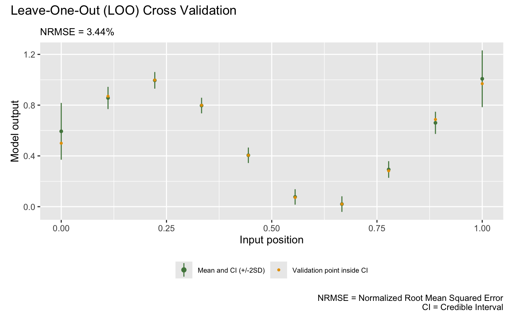
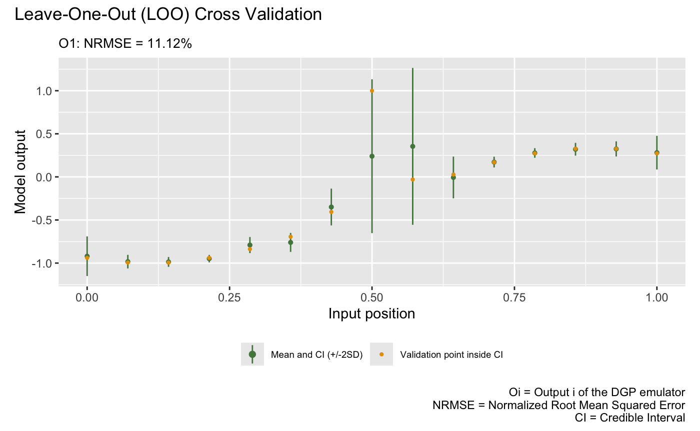
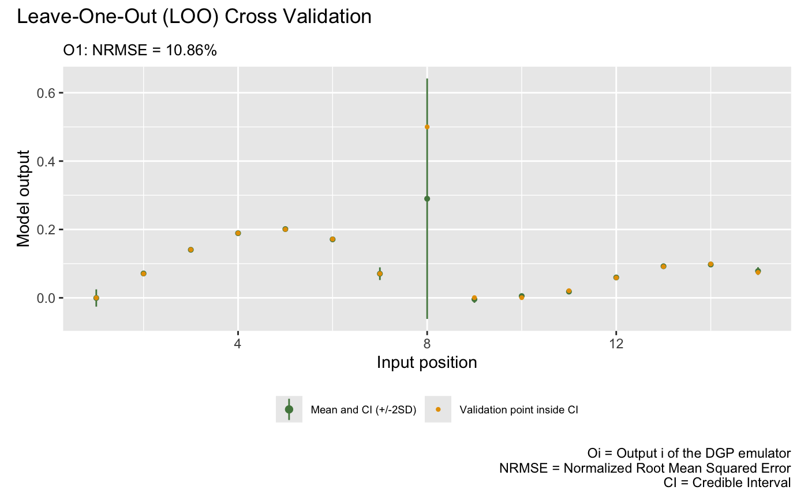

```{r setup, include = FALSE}
knitr::opts_chunk$set(
  echo = TRUE,
  eval = FALSE
)
```

This vignette shows how to use the package to emulate a feed-forward system of two synthetic computer models.

## Load the package

```{r}
library(dgpsi)
init_py()
```

```
## Connecting to Python ... done
## Importing required Python modules ... done
## The Python environment for 'dgpsi' is successfully loaded.
```

## Construct a synthetic system

We consider the following synthetic system

{width=60%}

that involves three models defined by:

```{r}
# Model 1
f1 <- function(x) {
  (sin(7.5*x)+1)/2
}
# Model 2
f2 <- function(x) {
  2/3*sin(2*(2*x - 1))+4/3*exp(-30*(2*(2*x-1))^2)-1/3  
}
# Model 3
f3 <- function(x) {
  x[1]*x[2]^2
}
# Linked Model 
f123 <- function(x) {
  f3(c(f1(x),f2(f1(x))))
}
```

We then generate 10 training data points for Model 1 and 15 training data points for Model 2 and 3:

```{r}
# Training data for Model 1
X1 <- seq(0, 1, length = 10)
Y1 <- sapply(X1, f1)
# Training data for Model 2
X2 <- seq(0, 1, length = 15)
Y2 <- sapply(X2, f2)
# Training data for Model 3
X3 <- cbind(X2, Y2)
Y3 <- apply(X3, f3, MARGIN = 1)
```

## Emulation of Model 1

We construct and train a GP emulator with Matérn-2.5 kernel:

```{r}
m1 <- gp(X1, Y1, name = "matern2.5")
```

```
## Auto-generating a GP structure ... done
## Initializing the GP emulator ... done
## Training the GP emulator ... done
```

We now validate the trained GP emulator by `plot()` by LOO (alternatively, one can first use `validate()` to store the LOO results before plotting with `plot()`):

```{r}
plot(m1)
```

```
## Initializing ... done
## Post-processing LOO results ... done
## Plotting ... done
```



Since we will use `m1` later for linked emulation, we must specify how it links to the emulators in the feeding layer through `linked_idx` in `dgp()`. Since `m1` is in the first layer of the system, `linked_idx` refers to the column indices of the global input `X` that will feed into `m1`, and therefore we should have set `linked_idx = c(1)` in `dgp()` when we first constructed the emulator. Instead of re-training the emulator to provide this information, we can simply use `set_linked_idx()` to add this information to `m1`:

```{r}
m1 <- set_linked_idx(m1, c(1))
```

## Emulation of Model 2

We construct a two-layered DGP emulator with Matérn-2.5 kernels to emulate the Model 2:

```{r}
m2 <- dgp(X2, Y2, depth = 2, name = "matern2.5", linked_idx = c(1))
```

```
## Auto-generating a 2-layered DGP structure ... done
## Initializing the DGP emulator ... done
## Training the DGP emulator:
## Iteration 500: Layer 2: 100%|██████████| 500/500 [00:02<00:00, 232.30it/s]
```

Since all outputs of emulators in the first layer is from `m1` and `m2` uses the output from `m1` as its input, we set `linked_idx = c(1)` in `dgp()` above. 

The following plot visualizes the LOO of the trained DGP emulator `m2`:

```{r}
plot(m2)
```

```
Initializing ... done
Post-processing LOO results ... done
Plotting ... done
```



## Emulation of Model 3

We now construct a three-layered DGP emulator with Matérn-2.5 kernels to emulate the Model 3:

```{r}
m3 <- dgp( X3, Y3, depth = 3, name = "matern2.5", linked_idx = list( c(1), c(1) ) )
```

```
## Auto-generating a 3-layered DGP structure ... done
## Initializing the DGP emulator ... done
## Training the DGP emulator:
## Iteration 500: Layer 3: 100%|██████████| 500/500 [00:06<00:00, 72.56it/s]
```

Since `m3` takes both outputs from `m1` in layer 1 and `m2` in layer 2, we set `linked_idx = list( c(1), c(1) )`. The first vector in the list says that the output dimension 1 from all emulators (i.e., `m1`) in the first layer feeds into `m3` and the second vector in the list says that the output dimension 1 from all emulators (i.e., `m2`) in the second layer feeds into `m3`. Note that the dimensions in `X3` is ordered in consistent with `linked_idx`, i.e., the first and second columns of `X3` correspond to the output of `m1` and `m2` respectively.

The following plot visualizes the LOO of the trained DGP emulator `m3`:

```{r}
plot(m3)
```

```
Initializing ... done
Post-processing LOO results ... done
Plotting ... done
```




## Emulation of Linked Model

With the GP emulator `m1` (for Model 1), the DGP emulator `m2` (for Model 2), and the DGP emulator `m3` (for Model 3) at hand, we are now ready to build the linked emulator by first using `combine()` to construct the system hierarchy `struc` and then applying `lgp()` for the linked emulator.  

```{r}
struc <- combine(list(m1), list(m2), list(m3))
m_link <- lgp(struc)
```

Note that each layer of an emulator system is represented by a list. In our case, each layer contains a single emulator. Therefore, we need to put the corresponding emulator in a list using `list()`.

We can check the relations between emulators in different layers by applying `summary()` to `m_link`:

```{r}
summary(m_link)
```

```
## +-----------+--------------+------+----------------------------+-----------------+
## | Layer No. | Emulator No. | Type |         Connection         | External Inputs |
## +-----------+--------------+------+----------------------------+-----------------+
## |  Layer 1  |    Emu 1     |  GP  |     Global input: [1]      |       No        |
## |  Layer 2  |    Emu 1     | DGP  | Emu 1 in Layer 1: output 1 |       No        |
## |  Layer 3  |    Emu 1     | DGP  | Emu 1 in Layer 1: output 1 |       No        |
## |           |              |      | Emu 1 in Layer 2: output 1 |                 |
## +-----------+--------------+------+----------------------------+-----------------+
## 1. 'Connection' gives the indices of emulators and the associated output dimensions that are linked to the emulator referred by 'Layer No.' and 'Emulator No.'.
## 2. 'External Inputs' indicates if the emulator (referred by 'Layer No.' and 'Emulator No.') has external inputs that are not provided by the feeding emulators.
```

For comparison, we construct a GP emulator for the whole system by generating 15 training data points from Model 1 and Model 2:

```{r}
X_gp <- seq(0, 1, length = 15)
Y_gp <- sapply(X_gp, f123)
m_gp <- gp(X_gp, Y_gp, name = 'matern2.5')
```

```
## Auto-generating a GP structure ... done
## Initializing the GP emulator ... done
## Training the GP emulator ... done
```

Finally, we make predictions from both the GP emulator and the linked emulator at 300 testing data points over $[0,1]$:

```{r}
# Testing input
test_x <- seq(0, 1, length = 300)
# Testing output
test_y <- sapply(test_x, f123)
```

```{r}
# linked emulator
m_link <- predict(m_link, x = test_x)
# GP emulator
m_gp <- predict(m_gp, x = test_x)
```

and plot the predictions to compare their emulation performances:

```{r}
# extract predictive means and variances from the linked emulator
mu <- m_link$results$mean$emulator1
sd <- sqrt(m_link$results$var$emulator1)
up <- mu + 2*sd
lo <- mu - 2*sd

# extract predictive means and variances from the GP emulator
mu_gp <- m_gp$results$mean
sd_gp <- sqrt(m_gp$results$var)
up_gp <- mu_gp + 2*sd_gp
lo_gp <- mu_gp - 2*sd_gp

par(cex=0.7, mar = c(5, 5, 0.9, 0.9)+0.2)
# GP emulator
par(fig = c(0, 0.5, 0.2, 0.8))
plot(test_x, mu_gp, type = 'l', lty = 2, lwd = 1.5, col = 'black', main = "GP Emulator", xlab = 'x1', ylab = 'y3', ylim=c(-0.1,0.65))
polygon(c(test_x, rev(test_x)), c(up_gp, rev(lo_gp)), col = 'grey80', border = F)
lines(test_x, test_y, type = 'l', col = "#D55E00", lwd = 2) 
lines(test_x, mu_gp, type = 'l', lty = 2, lwd = 1.5, col = 'black')
# linked emulator
par(fig = c(0.5, 1, 0.2, 0.8), new = TRUE)
plot(test_x, mu, type = 'l', lty = 2, lwd = 1.5, col = 'black', main = "Linked Emulator", xlab = 'x1', ylab = 'y3', ylim=c(-0.1,0.65))
polygon(c(test_x, rev(test_x)), c(up, rev(lo)), col = 'grey80', border = F)
lines(test_x, test_y, type = 'l', col = "#D55E00", lwd = 2) 
lines(test_x, mu, type = 'l', lty = 2, lwd = 1.5, col = 'black')
```


It can be seen from the above plots that the linked emulator outperforms the GP emulator with significantly better mean predictions and predictive uncertainties.

In real-life applications, we are rarely able to generate this many testing data points from the underlying computer simulators to evaluate the emulators over the whole input space. However, we are still able to retain some available realizations from the computer simulators for the linked emulator validation. Say we were able to afford 20 runs of the above linked computer system:

```{r}
# OOS testing input
test_x_oos <- sample(seq(0, 1, length = 300), 20)
# OOS testing output
test_y_oos <- sapply(test_x_oos, f123)
```

Then, we can conduct OOS validations for the GP emulator:

```{r}
plot(m_gp, test_x_oos, test_y_oos, style = 2)
```

```
## Initializing ... done
## Post-processing OOS results ... done
## Plotting ... done
```


and the linked emulator:

```{r}
plot(m_link, test_x_oos, test_y_oos, style = 2)
```

```
## Initializing ... done
## Post-processing OOS results ... done
## Plotting ... done
```


which show that the linked emulator outperforms the GP emulator with significantly better predictive accuracy and lower NRMSE.
