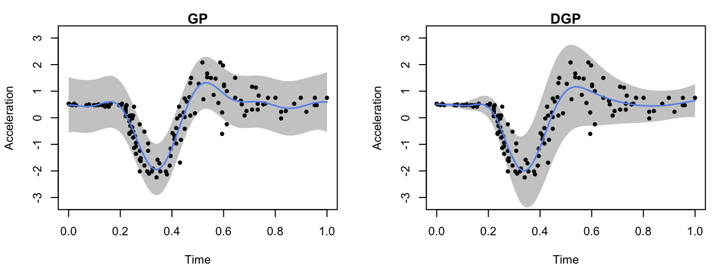

```{r setup, include = FALSE}
knitr::opts_chunk$set(
  echo = TRUE,
  eval = FALSE
)
```

This vignette gives a demonstration of the package on emulating the popular motorcycle dataset [@silverman1985].

## Load packages and data

We start by first loading the package and setting up the required Python environment via `init_py()` 

```{r}
library(dgpsi)
library(MASS)
init_py()
```

```
## The Python environment for dgpsi is successfully loaded.
```

`init_py()` provides an automatic Python environment setup and initialization routine and must be run every time after the package is loaded. We now load the training data points,

```{r}
X <- mcycle$times
Y <- mcycle$accel
```

scale them,

```{r}
X <- as.matrix((X - min(X))/(max(X)-min(X)))
Y <- as.matrix(scale(Y, center = TRUE, scale = TRUE))
```

and plot them:

```{r}
plot(X, Y, pch = 16, cex = 1, xlab = 'Time', ylab = 'Acceleration', cex.axis = 1.3, cex.lab = 1.3)
```


## Construct and train a DGP emulator

We consider a three-layered DGP emulator with squared exponential kernels:

```{r}
m_dgp <- dgp(X, Y, depth = 3, lengthscale = c(0.5, 0.2), likelihood = "Hetero", training = FALSE)
```

```
## Auto-generating a 3-layered DGP structure ... done
## Initializing the DGP emulator ... done
```

We choose a heteroskedastic Gaussian likelihood by setting `likelihood = "Hetero"` since the data drawn in the plot show varying noises. `lengthscale` is set to `c(0.5, 0.2)` where `0.5` is the initial lengthscale value for kernel functions of all GP nodes in the first layer and `0.2` is the initial lengthscale value for kernel functions of all GP nodes in the second layer. We set `training = FALSE` so `dgp()` only constructs a DGP structure and we can use `summary()` to check if our specifications for the DGP emulator is correct before proceeding to training:

```{r}
summary(m_dgp)
```

```
## +-----------+----------+---------------------+-----------------+---------------+-------------------+------------+-------------------+
## | Layer No. | Node No. |        Type         | Length-scale(s) |   Variance    |      Nugget       | Input Dims | Global Connection |
## +-----------+----------+---------------------+-----------------+---------------+-------------------+------------+-------------------+
## |  Layer 1  |  Node 1  |  GP (Squared-Exp)   |     [0.500]     | 1.000 (fixed) | 1.000e-06 (fixed) |    [1]     |        No         |
## |  Layer 2  |  Node 1  |  GP (Squared-Exp)   |     [0.200]     |     1.000     | 1.000e-06 (fixed) |    [1]     |        [1]        |
## |  Layer 2  |  Node 2  |  GP (Squared-Exp)   |     [0.200]     |     1.000     | 1.000e-06 (fixed) |    [1]     |        [1]        |
## |  Layer 3  |  Node 1  | Likelihood (Hetero) |       NA        |      NA       |        NA         |   [1, 2]   |        NA         |
## +-----------+----------+---------------------+-----------------+---------------+-------------------+------------+-------------------+
## 1. 'Input Dims' presents the indices of GP nodes in the feeding layer whose outputs are used as the input to the current GP.
## 2. 'Global Connection' indicates the dimensions (i.e., column numbers) of the global input data that are used as additional input dimensions to the current GP.
```

We can also use the untrained DGP emulator to make predictions so we can see how the emulation performance changes after the training:

```{r}
test_x <- as.matrix(seq(0, 1, length = 200))
m_dgp <- predict(m_dgp, x = test_x)

mu_dgp <- m_dgp$results$mean # predictive means
sd_dgp <- sqrt(m_dgp$results$var) # predictive variances and compute predictive standard deviations
up_dgp <- mu_dgp + 2*sd_dgp # predictive upper bound
lo_dgp <- mu_dgp - 2*sd_dgp # predictive lower bound

plot(test_x, mu_dgp, type = 'l', lwd = 1.5, col = 'cornflowerblue', main = "DGP", xlab = 'Time', ylab = 'Acceleration', ylim = c(-3.2,3.2))
polygon(c(test_x, rev(test_x)), c(up_dgp, rev(lo_dgp)), col = 'grey80', border = F)
lines(X, Y, type = 'p',pch = 16, cex = 0.8)
lines(test_x, mu_dgp, type = 'l', lwd = 1.5, col = 'cornflowerblue')
```


For a DGP emulator, we can use `continue()` to invoke the training for the constructed `m_dgp` instead of re-building everything from scratch by re-running `dgp()`:

```{r}
m_dgp <- continue(m_dgp)
```

```
## Continue the training:
## Iteration 500: Layer 3: 100%|██████████| 500/500 [00:20<00:00, 24.17it/s]
```

For comparison, we also build a GP emulator (by `gp()`) that incorporates homogeneous noises by setting `nugget_est = T` and the initial nugget value to $0.01$. We set `training` to `FALSE` so we can use `summary()` to check the generated GP structure before training:

```{r}
m_gp <- gp(X, Y, nugget_est = T, nugget = 1e-2, training = FALSE)
summary(m_gp)
```

```
## Auto-generating a GP structure: done
## Initializing the GP emulator ... done
## +-------------+-----------------+----------+--------+------------+
## | Kernel Fun  | Length-scale(s) | Variance | Nugget | Input Dims |
## +-------------+-----------------+----------+--------+------------+
## | Squared-Exp |     [0.200]     |  1.000   | 0.010  |    [1]     |
## +-------------+-----------------+----------+--------+------------+
## 'Input Dims' indicates the dimensions (i.e., columns) of your input data that are actually used for GP training.
```

We now train the GP emulator by re-running the above function with `training = TRUE`, which is the default setting:

```{r}
m_gp <- gp(X, Y, nugget_est = T, nugget = 1e-2)
```

```
## Auto-generating a GP structure: done
## Initializing the GP emulator ... done
## Training the GP emulator ... done
```

Before we make predictions, we can summarize the trained DGP emulator:

```{r}
summary(m_dgp)
```

```
## +-----------+----------+---------------------+-----------------+---------------+-------------------+------------+-------------------+
## | Layer No. | Node No. |        Type         | Length-scale(s) |   Variance    |      Nugget       | Input Dims | Global Connection |
## +-----------+----------+---------------------+-----------------+---------------+-------------------+------------+-------------------+
## |  Layer 1  |  Node 1  |  GP (Squared-Exp)   |     [1.081]     | 1.000 (fixed) | 1.000e-06 (fixed) |    [1]     |        No         |
## |  Layer 2  |  Node 1  |  GP (Squared-Exp)   |     [0.385]     |     1.127     | 1.000e-06 (fixed) |    [1]     |        [1]        |
## |  Layer 2  |  Node 2  |  GP (Squared-Exp)   |     [0.688]     |    10.511     | 1.000e-06 (fixed) |    [1]     |        [1]        |
## |  Layer 3  |  Node 1  | Likelihood (Hetero) |       NA        |      NA       |        NA         |   [1, 2]   |        NA         |
## +-----------+----------+---------------------+-----------------+---------------+-------------------+------------+-------------------+
## 1. 'Input Dims' presents the indices of GP nodes in the feeding layer whose outputs are used as the input to the current GP.
## 2. 'Global Connection' indicates the dimensions (i.e., column numbers) of the global input data that are used as additional input dimensions to the current GP.
```

and GP emulator:

```{r}
summary(m_gp)
```

```
## +-------------+-----------------+----------+--------+------------+
## | Kernel Fun  | Length-scale(s) | Variance | Nugget | Input Dims |
## +-------------+-----------------+----------+--------+------------+
## | Squared-Exp |     [0.132]     |  0.780   | 0.282  |    [1]     |
## +-------------+-----------------+----------+--------+------------+
## 'Input Dims' indicates the dimensions (i.e., columns) of your input data that are actually used for GP training.
```

## Prediction

We are now ready to make predictions from both emulators via `predict()` at 200 testing positions over $[0,1]$:

```{r}
test_x <- as.matrix(seq(0, 1, length = 200))
m_dgp <- predict(m_dgp, x = test_x)
m_gp <- predict(m_gp, x = test_x)
```

Finally, we plot the predictions from both emulators to check their emulation performance:

```{r}
# extract predictive means and variances from DGP
mu_dgp <- m_dgp$results$mean # predictive means
sd_dgp <- sqrt(m_dgp$results$var) # predictive variances and compute predictive standard deviations
up_dgp <- mu_dgp + 2*sd_dgp # predictive upper bound
lo_dgp <- mu_dgp - 2*sd_dgp # predictive lower bound

# extract predictive means and variances from GP
mu_gp <- m_gp$results$mean
sd_gp <- sqrt(m_gp$results$var)
up_gp <- mu_gp + 2*sd_gp
lo_gp <- mu_gp - 2*sd_gp

par(cex=0.7, mar = c(5, 5, 0.9, 0.9)+0.2)
#GP
par(fig = c(0, 0.5, 0.2, 0.8))
plot(test_x, mu_gp, type = 'l', lwd = 1.5, col = 'cornflowerblue', main = "GP", xlab = 'Time', ylab = 'Acceleration', ylim = c(-3.2,3.2))
polygon(c(test_x, rev(test_x)), c(up_gp, rev(lo_gp)), col = 'grey80', border = F)
lines(X, Y, type = 'p',pch = 16, cex = 0.8)
lines(test_x, mu_gp, type = 'l', lwd = 1.5, col = 'cornflowerblue')
#DGP
par(fig = c(0.5, 1, 0.2, 0.8), new = TRUE)
plot(test_x, mu_dgp, type = 'l', lwd = 1.5, col = 'cornflowerblue', main = "DGP", xlab = 'Time', ylab = 'Acceleration', ylim = c(-3.2,3.2))
polygon(c(test_x, rev(test_x)), c(up_dgp, rev(lo_dgp)), col = 'grey80', border = F)
lines(X, Y, type = 'p',pch = 16, cex = 0.8)
lines(test_x, mu_dgp, type = 'l', lwd = 1.5, col = 'cornflowerblue')
```



The visualization shows that the DGP emulator gives a better performance than the GP emulator on modeling the heteroskedastic noises embedded in the underlying dataset.

### References

