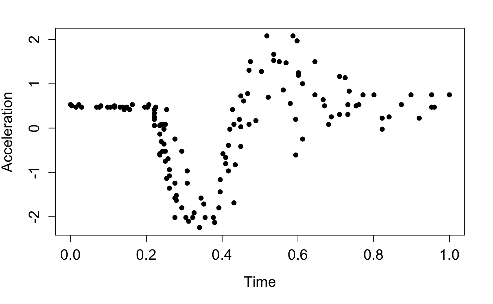
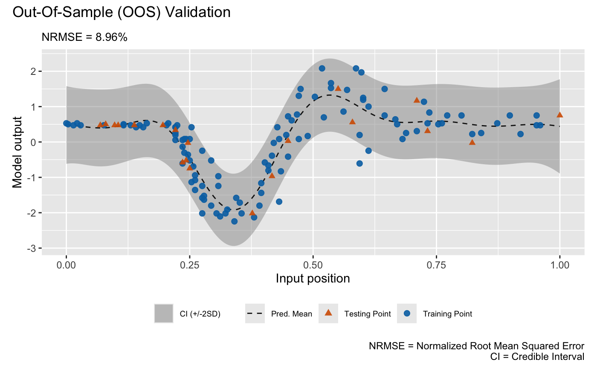
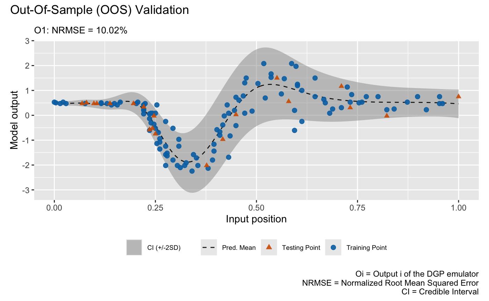

```{r setup, include = FALSE}
knitr::opts_chunk$set(
  echo = TRUE,
  eval = FALSE
)
```

This vignette gives a demonstration of the package on emulating the popular motorcycle dataset [@silverman1985].

## Load packages and data

We start by loading packages:

```{r}
library(dgpsi)
library(MASS)
library(patchwork)
```

We now load the training data points,

```{r}
X <- mcycle$times
Y <- mcycle$accel
```

scale them,

```{r}
X <- (X - min(X))/(max(X)-min(X))
Y <- scale(Y, center = TRUE, scale = TRUE)
```

and plot them:

```{r}
plot(X, Y, pch = 16, cex = 1, xlab = 'Time', ylab = 'Acceleration', cex.axis = 1.3, cex.lab = 1.3)
```



Before constructing an emulator, we first specify a seed with `set_seed()` from the package for reproducibility

```{r}
set_seed(99)
```

and split a training data set and a testing data set:

```{r}
test_idx <- sample(seq_len(length(X)), size = 20)
train_X <- X[-test_idx]
train_Y <- Y[-test_idx,]
test_x <- X[test_idx]
test_y <- Y[test_idx,]
```

## Construct and train a DGP emulator

We consider a three-layered DGP emulator with squared exponential kernels:

```{r}
m_dgp <- dgp(train_X, train_Y, depth = 3, lengthscale = c(0.5, 0.2), likelihood = "Hetero", training = FALSE)
```

```
## Auto-generating a 3-layered DGP structure ... done
## Initializing the DGP emulator ... done
## Imputing ... done
```

We choose a heteroskedastic Gaussian likelihood by setting `likelihood = "Hetero"` since the data drawn in the plot show varying noises. `lengthscale` is set to `c(0.5, 0.2)` where `0.5` is the initial lengthscale value for kernel functions of all GP nodes in the first layer and `0.2` is the initial lengthscale value for kernel functions of all GP nodes in the second layer. We set `training = FALSE` so `dgp()` only constructs a DGP structure and we can use `summary()` to check if our specifications for the DGP emulator is correct before proceeding to training:

```{r}
summary(m_dgp)
```

```
## +-----------+----------+---------------------+-----------------+---------------+-------------------+------------+-------------------+
## | Layer No. | Node No. |        Type         | Length-scale(s) |   Variance    |      Nugget       | Input Dims | Global Connection |
## +-----------+----------+---------------------+-----------------+---------------+-------------------+------------+-------------------+
## |  Layer 1  |  Node 1  |  GP (Squared-Exp)   |     [0.500]     | 1.000 (fixed) | 1.000e-06 (fixed) |    [1]     |        No         |
## |  Layer 2  |  Node 1  |  GP (Squared-Exp)   |     [0.200]     |     1.000     | 1.000e-06 (fixed) |    [1]     |        [1]        |
## |  Layer 2  |  Node 2  |  GP (Squared-Exp)   |     [0.200]     |     1.000     | 1.000e-06 (fixed) |    [1]     |        [1]        |
## |  Layer 3  |  Node 1  | Likelihood (Hetero) |       NA        |      NA       |        NA         |   [1, 2]   |        NA         |
## +-----------+----------+---------------------+-----------------+---------------+-------------------+------------+-------------------+
## 1. 'Input Dims' presents the indices of GP nodes in the feeding layer whose outputs feed into the GP node referred by 'Layer No.' and 'Node No.'.
## 2. 'Global Connection' indicates the dimensions (i.e., column indices) of the global input data that are used as additional input dimensions to the GP node referred by 'Layer No.' and 'Node No.'.
```

For a DGP emulator, we can use `continue()` to invoke the training for the constructed `m_dgp` instead of re-building everything from scratch by re-running `dgp()`:

```{r}
m_dgp <- continue(m_dgp)
```

```
## Continue the training:
## Iteration 500: Layer 3: 100%|██████████| 500/500 [00:15<00:00, 31.52it/s]
## Imputing ... done
```

For comparison, we also build a GP emulator (by `gp()`) that incorporates homogeneous noises by setting `nugget_est = T` and the initial nugget value to $0.01$. We set `training` to `FALSE` so we can use `summary()` to check the generated GP structure before training:

```{r}
m_gp <- gp(train_X, train_Y, nugget_est = T, nugget = 1e-2, training = FALSE)
summary(m_gp)
```

```
## Auto-generating a GP structure ... done
## Initializing the GP emulator ... done
## +-------------+-----------------+----------+--------+------------+
## | Kernel Fun  | Length-scale(s) | Variance | Nugget | Input Dims |
## +-------------+-----------------+----------+--------+------------+
## | Squared-Exp |     [0.100]     |  1.000   | 0.010  |    [1]     |
## +-------------+-----------------+----------+--------+------------+
## 'Input Dims' indicates the dimensions (i.e., column indices) of your input data that are used for GP emulator training.
```

We now train the GP emulator by re-running the above function with `training = TRUE`, which is the default setting:

```{r}
m_gp <- gp(train_X, train_Y, nugget_est = T, nugget = 1e-2)
```

```
## Auto-generating a GP structure ... done
## Initializing the GP emulator ... done
## Training the GP emulator ... done
```

Before we validate the constructed emulators, we can summarize the trained DGP emulator:

```{r}
summary(m_dgp)
```

```
## +-----------+----------+---------------------+-----------------+---------------+-------------------+------------+-------------------+
## | Layer No. | Node No. |        Type         | Length-scale(s) |   Variance    |      Nugget       | Input Dims | Global Connection |
## +-----------+----------+---------------------+-----------------+---------------+-------------------+------------+-------------------+
## |  Layer 1  |  Node 1  |  GP (Squared-Exp)   |     [0.731]     | 1.000 (fixed) | 1.000e-06 (fixed) |    [1]     |        No         |
## |  Layer 2  |  Node 1  |  GP (Squared-Exp)   |     [0.636]     |     1.273     | 1.000e-06 (fixed) |    [1]     |        [1]        |
## |  Layer 2  |  Node 2  |  GP (Squared-Exp)   |     [1.431]     |    12.183     | 1.000e-06 (fixed) |    [1]     |        [1]        |
## |  Layer 3  |  Node 1  | Likelihood (Hetero) |       NA        |      NA       |        NA         |   [1, 2]   |        NA         |
## +-----------+----------+---------------------+-----------------+---------------+-------------------+------------+-------------------+
## 1. 'Input Dims' presents the indices of GP nodes in the feeding layer whose outputs feed into the GP node referred by 'Layer No.' and 'Node No.'.
## 2. 'Global Connection' indicates the dimensions (i.e., column indices) of the global input data that are used as additional input dimensions to the GP node referred by 'Layer No.' and 'Node No.'.
```

and GP emulator:

```{r}
summary(m_gp)
```

```
## +-------------+-----------------+----------+--------+------------+
## | Kernel Fun  | Length-scale(s) | Variance | Nugget | Input Dims |
## +-------------+-----------------+----------+--------+------------+
## | Squared-Exp |     [0.131]     |  0.791   | 0.246  |    [1]     |
## +-------------+-----------------+----------+--------+------------+
## 'Input Dims' indicates the dimensions (i.e., column indices) of your input data that are used for GP emulator training.
```

## Validation

We are now ready to validate both emulators via `validate()` at 20 out-of-sample testing positions generated earlier:

```{r}
m_dgp <- validate(m_dgp, test_x, test_y)
```

```
## Initializing the OOS ... done
## Calculating the OOS ... done
## Saving results to the slot 'oos' in the dgp object ... done
```

```{r}
m_gp <- validate(m_gp, test_x, test_y)
```

```
## Initializing the OOS ... done
## Calculating the OOS ... done
## Saving results to the slot 'oos' in the gp object ... done
```

Note that using `validate()` before plotting can saving computations involved in `plot()` because `validate()` stores validation results in the emulator objects. Finally, we plot the OOS validations for the GP emulator:

```{r}
plot(m_gp, test_x, test_y)
```

```
## Initializing ... done
## Post-processing OOS results ... done
## Plotting ... done
```



and for the DGP emulator:

```{r}
plot(m_dgp, test_x, test_y)
```

```
## Initializing ... done
## Post-processing OOS results ... done
## Plotting ... done
```



Note that we still need to provide `test_x` and `test_y` to `plot()` even they have already been provided to `validate()`. Otherwise, `plot()` will draw the LOO cross validation plot. The visualizations above show that the DGP emulator gives a better performance than the GP emulator on modeling the heteroskedastic noises embedded in the underlying data set, even though they have quite similar NRMSEs.

### References

