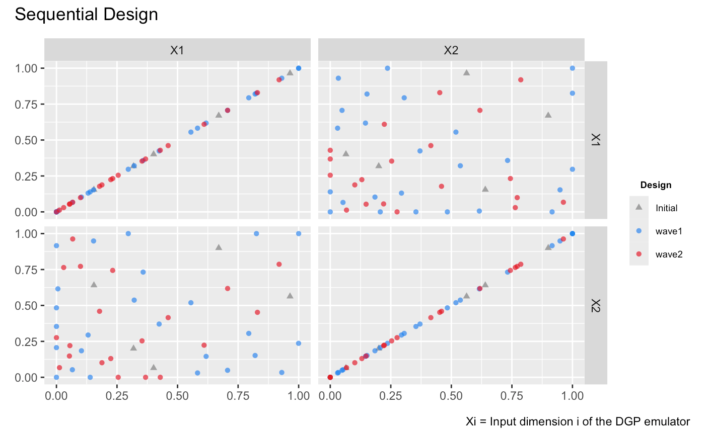
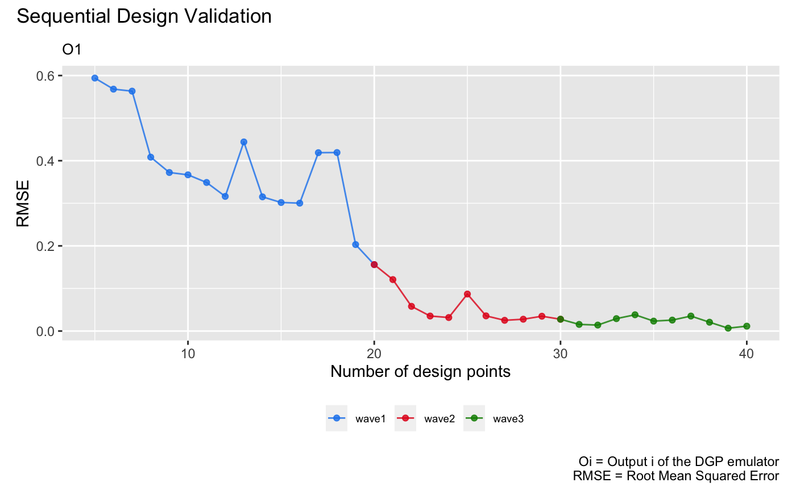
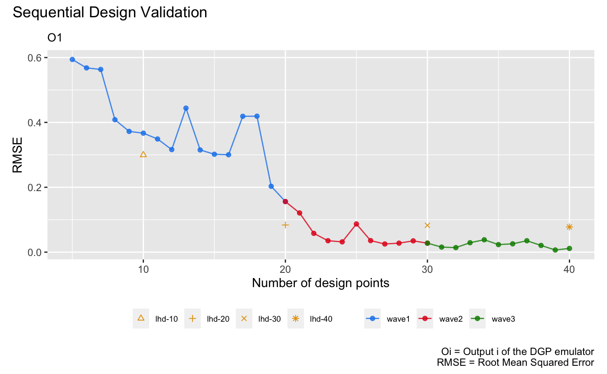

```{r setup, include = FALSE}
knitr::opts_chunk$set(
  echo = TRUE,
  eval = FALSE
)
```

This vignette shows how to use the package to sequentially enrich the design for adaptive improvements of a DGP emulator.

## Load the packages

```{r}
library(lhs)
library(ggplot2)
library(dgpsi)
init_py()
```

```
## Connecting to Python ... done
## Importing required Python modules ... done
## The Python environment for 'dgpsi' is successfully loaded.
```

## Construct a synthetic simulator

We consider a non-stationary synthetic simulator which has a 2-dimensional input with the functional form [@Ba2018] defined by:

```{r}
f <- function(x) {
 sin(1/((0.7*x[1]+0.3)*(0.7*x[2]+0.3)))
 }
```

We now generate an initial design with 5 design points using the maximin Latin hypercube sampler:

```{r}
X <- maximinLHS(5,2)
Y <- apply(X, f, MARGIN = 1)
```

To track the qualities of constructed emulators during the sequential design, we generate a validation dataset:

```{r}
validate_x <- maximinLHS(200,2)
validate_y <- apply(validate_x, f, MARGIN = 1)
```

## DGP emulation with the sequential design

To start with the sequential design, we initialize a two-layered DGP emulator using the generated initial design:

```{r}
m <- dgp(X, Y)
```

```
## Auto-generating a 2-layered DGP structure ... done
## Initializing the DGP emulator ... done
## Training the DGP emulator: 
## Iteration 500: Layer 2: 100%|██████████| 500/500 [00:01<00:00, 257.04it/s]
## Imputing ... done
```

We then specify the boundaries of input parameters of `f` for the sequential design to locate design points to be added:

```{r}
lim_1 <- c(0, 1)
lim_2 <- c(0, 1)
lim <- rbind(lim_1, lim_2)
```

The boundaries of input parameters are defined as a matrix with each row giving the lower and upper limits of an input parameter. After the boundaries are specified, we are ready to conduct the sequential design to adaptively improve the emulator `m` via `design()`. The function `design()` provides a simple and flexible implementation of sequential designs for DGP emulators. In this vignette, we only demonstrate its basic usage and refer users to `?design` for more advanced specifications, e.g., on checkpoints to manually control the design progress and on schedules to re-fit and validate emulators. 

For illustrative purpose, we implement three waves of sequential designs on `m`:

```{r}
# 1st wave with 15 steps
m <- design(m, N=15, limits = lim, f = f, x_test = validate_x, y_test = validate_y)
```

```
## Initializing ... done
##  * RMSE: 0.594074
## Iteration 1:
##  - Locating ... done
##  * Next design point: 0.079902 0.983106
##  - Updating and re-fitting ... done
##  - Validating ... done
##  * RMSE: 0.568041
## 
## ...
## 
## Iteration 15:
##  - Locating ... done
##  * Next design point: 0.036521 0.401034
##  - Updating and re-fitting ... done
##  - Validating ... done
##  * RMSE: 0.156026
```

```{r}
# 2nd wave with 10 steps
m <- design(m, N=10, limits = lim, f = f, x_test = validate_x, y_test = validate_y)
```
```
## Initializing ... done
##  * RMSE: 0.156026
## Iteration 1:
##  - Locating ... done
##  * Next design point: 0.352486 0.058607
##  - Updating and re-fitting ... done
##  - Validating ... done
##  * RMSE: 0.120827
##   
##  ...
##  
## Iteration 10:
##  - Locating ... done
##  * Next design point: 0.838479 0.153060
##  - Updating and re-fitting ... done
##  - Validating ... done
##  * RMSE: 0.027707
```

```{r}
# 3rd wave with 10 steps
m <- design(m, N=10, limits = lim, f = f, x_test = validate_x, y_test = validate_y)
```

```
## Initializing ... done
##  * RMSE: 0.027707
## Iteration 1:
##  - Locating ... done
##  * Next design point: 0.248362 0.985979
##  - Updating and re-fitting ... done
##  - Validating ... done
##  * RMSE: 0.015556
##  
##  ...
##  
## Iteration 10:
##  - Locating ... done
##  * Next design point: 0.972808 0.693536
##  - Updating and re-fitting ... done
##  - Validating ... done
##  * RMSE: 0.011444
```

After the sequential design is done, we can inspect the enriched design by applying `draw()` to `m`:

```{r}
draw(m, 'design')
```


It can be seen from the figure above that most of the added design points concentrate at the bottom-left corner of the input space where the simulator `f` exhibits more variations and thus needs more data to be well-emulated. We can also visualize the changes of qualities (in terms of RMSEs wrt the validation dataset) of emulators constructed during the three waves of sequential designs:

```{r}
draw(m, 'rmse')
```


## Comparison to DGP emulators with space-filling designs

We build four DGP emulators with static space-filling Latin hypercube designs (LHD) of size 10, 20, 30, and 40 respectively:

```{r}
# DGP emulator with a LHD of size 10
X1 <- maximinLHS(10,2)
Y1 <- apply(X1, f, MARGIN = 1)
m1 <- dgp(X1, Y1, verb = F)
```

```{r}
# DGP emulator with a LHD of size 20
X2 <- maximinLHS(20,2)
Y2 <- apply(X2, f, MARGIN = 1)
m2 <- dgp(X2, Y2, verb = F)
```

```{r}
# DGP emulator with a LHD of size 30
X3 <- maximinLHS(30,2)
Y3 <- apply(X3, f, MARGIN = 1)
m3 <- dgp(X3, Y3, verb = F)
```

```{r}
# DGP emulator with a LHD of size 40
X4 <- maximinLHS(40,2)
Y4 <- apply(X4, f, MARGIN = 1)
m4 <- dgp(X4, Y4, verb = F)
```

We then extract their RMSEs

```{r}
# validation of the DGP emulator with the LHD of size 10
m1 <- validate(m1, x_test = validate_x, y_test = validate_y, verb = F)
rmse1 <- m1$oos$rmse
# validation of the DGP emulator with the LHD of size 20
m2 <- validate(m2, x_test = validate_x, y_test = validate_y, verb = F)
rmse2 <- m2$oos$rmse
# validation of the DGP emulator with the LHD of size 30
m3 <- validate(m3, x_test = validate_x, y_test = validate_y, verb = F)
rmse3 <- m3$oos$rmse
# validation of the DGP emulator with the LHD of size 40
m4 <- validate(m4, x_test = validate_x, y_test = validate_y, verb = F)
rmse4 <- m4$oos$rmse
# create a dataframe that stores the RMSEs of the four DGP emulators
rmse_static <- data.frame('N' = c(10, 20, 30, 40), 'rmse' = c(rmse1, rmse2, rmse3, rmse4), 'design' = c('lhd-10', 'lhd-20', 'lhd-30', 'lhd-40'))
```

and add them to the sequential design validation plot for comparisons:

```{r}
draw(m, 'rmse') + 
  geom_point(data = rmse_static, mapping = aes(x = N, y = rmse, group = design, shape = design), color = '#E69F00', size = 1.5) +
  scale_shape_manual(values = c(2, 3, 4, 8))
```



It can be seen from the plot above that with static space-filling designs, the quality of an emulator may not be improved as the design size increases. This is because increasing the size of a space-filling design may not capture regions where the simulator exhibits more variations, and thus cause DGP emulators with higher RMSEs than those constructed through the sequential design.

### References


