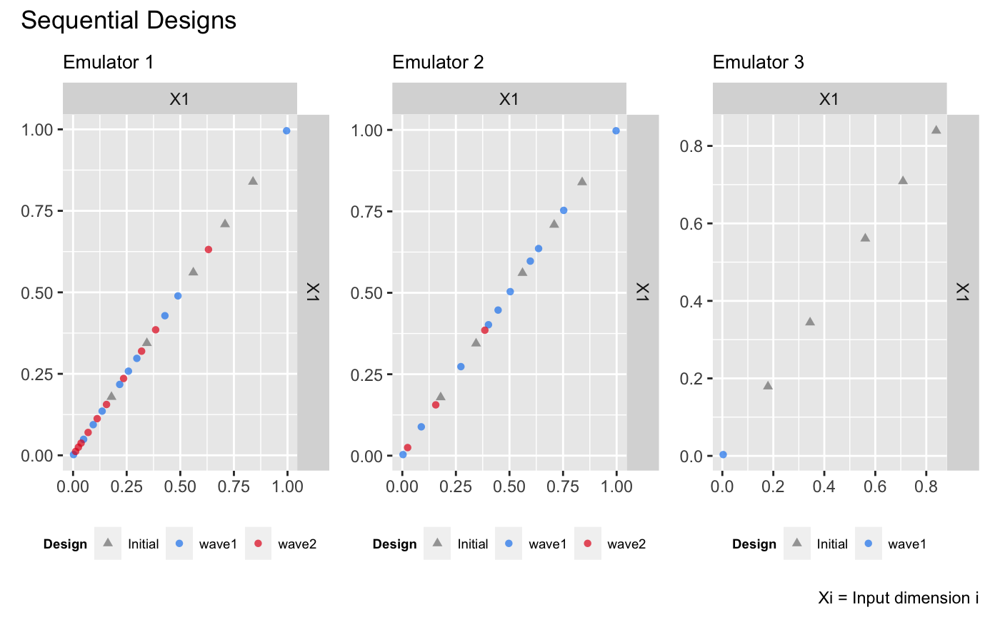
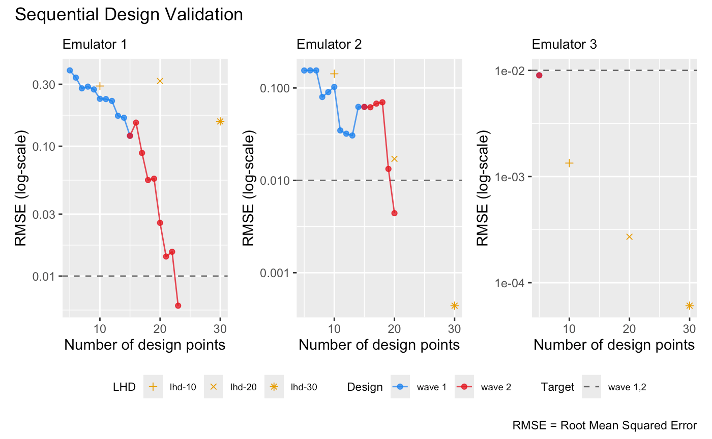

```{r setup, include = FALSE}
knitr::opts_chunk$set(
  echo = TRUE,
  eval = FALSE
)
```

This vignette shows how to use the package to sequentially refine a bundle of DGP emulators, each of which emulates an output of a simulator.

## Load the packages

```{r}
library(lhs)
library(ggplot2)
library(patchwork)
library(dgpsi)
```

## Construct a synthetic simulator

We construct a synthetic simulator that has a one-dimensional input between `[0, 1]` and a three-dimensional output.

```{r}
f <- function(x) {
  y1 = sin(30*((2*x-1)/2-0.4)^5)*cos(20*((2*x-1)/2-0.4))
  y2 = 1/3*sin(2*(2*x - 1))+2/3*exp(-30*(2*(2*x-1))^2)+1/3
  y3 = (sin(7.5*x)+1)/2
  return(cbind(y1, y2, y3))
}
```

Note that the function is defined in such a way that both its input `x` and output are matrices. The following figure shows the true functional forms of the three outputs of the simulator over `[0, 1]`:

```{r}
dense_x <- seq(0, 1, length = 200)
dense_y <- f(dense_x)
output1 <- data.frame('x' = dense_x, 'y' = dense_y[,1])
output2 <- data.frame('x' = dense_x, 'y' = dense_y[,2])
output3 <- data.frame('x' = dense_x, 'y' = dense_y[,3])
p1 <- ggplot(data = output1, aes(x = x, y = y)) + geom_line(color = 'dodgerblue2') + ggtitle('Output 1') + theme(plot.title = element_text(size = 10))
p2 <- ggplot(data = output2, aes(x = x, y = y)) + geom_line(color = '#E31A1C') + ggtitle('Output 2') + theme(plot.title = element_text(size = 10))
p3 <- ggplot(data = output3, aes(x = x, y = y)) + geom_line(color = 'green4') + ggtitle('Output 3') + theme(plot.title = element_text(size = 10))
wrap_plots(list(p1, p2, p3)) + plot_annotation(title = 'Synthetic Simulator')
```


We now specify a seed with `set_seed()` from the package for reproducibility

```{r}
set_seed(999)
```

and generate an initial design with 5 design points using the maximin Latin hypercube sampler:

```{r}
X <- maximinLHS(5, 1)
Y <- f(X)
```

We generate a validation dataset to track and stop the sequential design:

```{r}
validate_x <- maximinLHS(200, 1)
validate_y <- f(validate_x)
```

## Construct a bundle of DGP emulators

Before we start the sequential design, we build three DGP emulators that emulate the three outputs of the simulator `f` independently:

```{r}
m1 <- dgp(X, Y[,1], connect = F)
```

```
## Auto-generating a 2-layered DGP structure ... done
## Initializing the DGP emulator ... done
## Training the DGP emulator: 
## Iteration 500: Layer 2: 100%|██████████| 500/500 [00:01<00:00, 335.63it/s]
## Imputing ... done
```

```{r}
m2 <- dgp(X, Y[,2], connect = F)
```

```
## Auto-generating a 2-layered DGP structure ... done
## Initializing the DGP emulator ... done
## Training the DGP emulator: 
## Iteration 500: Layer 2: 100%|██████████| 500/500 [00:01<00:00, 294.20it/s]
## Imputing ... done
```

```{r}
m3 <- dgp(X, Y[,3])
```

```
## Auto-generating a 2-layered DGP structure ... done
## Initializing the DGP emulator ... done
## Training the DGP emulator: 
## Iteration 500: Layer 2: 100%|██████████| 500/500 [00:01<00:00, 387.69it/s]
## Imputing ... done
```

Note that we have the global connection turned off for the first two DGP emulators because we found that this yields better emulation performances. We then build a bundle of the three DGP emulators using `pack()`:

```{r}
m <- pack(m1, m2, m3)
```

## Sequential designs of the bundle emulator

To start with the sequential design, we specify the limit of the input:

```{r}
lim <- c(0, 1)
```

and set a target RMSE to stop the sequential design:

```{r}
target <- 0.01
```

Here we choose `0.01` because it is equivalent to `1%` normalized error given that the ranges of both outputs are `[0,1]`. We can of course set different targets for different outputs, e.g., by setting `target <- c(0.005, 0.02, 0.01)`. 

We start the first-wave of the sequential design with 10 steps:

```{r}
# 1st wave of the sequential design with 10 steps
m <- design(m, N = 10, limits = lim, f = f, x_test = validate_x, y_test = validate_y, target = target)
```

```
## Initializing ... done
##  * RMSE: 0.340553 0.158352 0.019125
## Iteration 1:
##  - Locating ... done
##  * Next design point (Emulator1): 0.467905
##  * Next design point (Emulator2): 0.003782
##  * Next design point (Emulator3): 0.997096
##  - Updating and re-fitting ... done
##  - Validating ... done
##  * RMSE: 0.309701 0.158634 0.006056
## Iteration 2:
##  - Locating ... done
##  * Next design point (Emulator1): 0.997773
##  * Next design point (Emulator2): 0.997773
##  * Next design point (Emulator3): None (target reached)
##  - Updating and re-fitting ... done
##  - Validating ... done
##  * RMSE: 0.291350 0.159032 0.006056
##  
##  ...
##  
## Iteration 10:
##  - Locating ... done
##  * Next design point (Emulator1): 0.198829
##  * Next design point (Emulator2): 0.311879
##  * Next design point (Emulator3): None (target reached)
##  - Updating and re-fitting ... done
##  - Validating ... done
##  * RMSE: 0.190766 0.014075 0.006056
## Targets are not reached for all emulators at the end of the sequential design.
```

It can be seen that at the second step, the DGP emulator for the third output has already reached the target, so for the rest of the steps no further refinements (i.e., additions of design points to the third DGP emulator) are performed. At the end of the first wave, the DGP emulators for both the first and second outputs have not reached the target yet. At this point, we can proceed to a second wave by repeating the command above, but we show below an alternative way, in which we define an aggregation function that aggregates criterion scores across the three outputs such that the same design points are added to the three emulators at each step (instead of different design points for each emulator). We define the aggregation function `g` that aggregate scores by calculating their weighted average: 

```{r}
g <- function(x, weight){
  x[,1] <- x[,1]*weight[1]
  x[,2] <- x[,2]*weight[2]
  x[,3] <- x[,3]*weight[3]
  return(rowSums(x))
}
```

Since the third emulator has already reached the target, we assign zero weights to it and weights of 0.8 and 0.2 to the first and second emulators respectively:

```{r}
weight <- c(0.8, 0.2, 0)
```

We now pass both the aggregate function `g()` and its `weight` argument to `design()` for the second wave of the sequential design with a further 15 steps:

```{r}
# 2nd wave with 15 steps
m <- design(m, N = 15, limits = lim, f = f, x_test = validate_x, y_test = validate_y, aggregate = g, target = 0.01, weight = weight)
```
```
## Initializing ... done
##  * RMSE: 0.190766 0.014075 0.006056
## Iteration 1:
##  - Locating ... done
##  * Next design point (Emulator1): 0.263892
##  * Next design point (Emulator2): 0.263892
##  * Next design point (Emulator3): None (target reached)
##  - Updating and re-fitting ... done
##  - Validating ... done
##  * RMSE: 0.176965 0.009466 0.006056
## Iteration 2:
##  - Locating ... done
##  * Next design point (Emulator1): 0.030840
##  * Next design point (Emulator2): None (target reached)
##  * Next design point (Emulator3): None (target reached)
##  - Updating and re-fitting ... done
##  - Validating ... done
##  * RMSE: 0.204744 0.009466 0.006056
##  
##  ...
## 
## Iteration 11:
##  - Locating ... done
##  * Next design point (Emulator1): 0.105318
##  * Next design point (Emulator2): None (target reached)
##  * Next design point (Emulator3): None (target reached)
##  - Updating and re-fitting ... done
##  - Validating ... done
##  * RMSE: 0.009740 0.009466 0.006056
## Target reached! The sequential design stops at step 11.
```

The first and the second emulators reached the target after iteration 11 and 1 of the second wave, respectively. The sequential designs of the three emulators can be plotted with `draw()`:

```{r}
draw(m, 1, 'design') + draw(m, 2, 'design') + draw(m, 3, 'design') +
  plot_layout() & theme(legend.position = 'bottom')
```



The figure above shows that for the first emulator most of the design points are added below 0.5 whilst for the second emulator most of the design points concentrate around 0.5. For the third emulator, the resulting design is space-filling. It can be seen that these design point distributions are consistent with the functional complexities of the three outputs. 

## Comparison to DGP emulators with space-filling designs

We build three independent DGP emulators for the three outputs with static space-filling Latin hypercube designs (LHD) of size 10, 20, and 30 respectively:

```{r}
# DGP emulators with a LHD of size 10
X1 <- maximinLHS(10, 1)
Y1 <- f(X1)
m11 <- dgp(X1, Y1[,1], connect = F, verb = F)
m12 <- dgp(X1, Y1[,2], connect = F, verb = F)
m13 <- dgp(X1, Y1[,3], verb = F)
```

```{r}
# DGP emulator with a LHD of size 20
X2 <- maximinLHS(20, 1)
Y2 <- f(X2)
m21 <- dgp(X2, Y2[,1], connect = F, verb = F)
m22 <- dgp(X2, Y2[,2], connect = F, verb = F)
m23 <- dgp(X2, Y2[,3], verb = F)
```

```{r}
# DGP emulator with a LHD of size 30
X3 <- maximinLHS(30, 1)
Y3 <- f(X3)
m31 <- dgp(X3, Y3[,1], connect = F, verb = F)
m32 <- dgp(X3, Y3[,2], connect = F, verb = F)
m33 <- dgp(X3, Y3[,3], verb = F)
```

We then extract their RMSEs

```{r}
# validations of the first DGP emulator
m11 <- validate(m11, x_test = validate_x, y_test = validate_y[,1], verb = F)
m21 <- validate(m21, x_test = validate_x, y_test = validate_y[,1], verb = F)
m31 <- validate(m31, x_test = validate_x, y_test = validate_y[,1], verb = F)
rmse_static_1 <- data.frame('N' = c(10, 20, 30), 'rmse' = c(m11$oos$rmse, m21$oos$rmse, m31$oos$rmse), 'LHD' = c('lhd-10', 'lhd-20', 'lhd-30'))
# validations of the second DGP emulator
m12 <- validate(m12, x_test = validate_x, y_test = validate_y[,2], verb = F)
m22 <- validate(m22, x_test = validate_x, y_test = validate_y[,2], verb = F)
m32 <- validate(m32, x_test = validate_x, y_test = validate_y[,2], verb = F)
rmse_static_2 <- data.frame('N' = c(10, 20, 30), 'rmse' = c(m12$oos$rmse, m22$oos$rmse, m32$oos$rmse), 'LHD' = c('lhd-10', 'lhd-20', 'lhd-30'))
# # validations of the third DGP emulator
m13 <- validate(m13, x_test = validate_x, y_test = validate_y[,3], verb = F)
m23 <- validate(m23, x_test = validate_x, y_test = validate_y[,3], verb = F)
m33 <- validate(m33, x_test = validate_x, y_test = validate_y[,3], verb = F)
rmse_static_3 <- data.frame('N' = c(10, 20, 30), 'rmse' = c(m13$oos$rmse, m23$oos$rmse, m33$oos$rmse), 'LHD' = c('lhd-10', 'lhd-20', 'lhd-30'))
```

and add them to the sequential design validation plot (in log-scale) for comparisons:

```{r}
p1 <- draw(m, emulator = 1, type = 'rmse', log = T) + 
  geom_point(data = rmse_static_1, mapping = aes(x = N, y = rmse, group = LHD, shape = LHD), color = '#E69F00', size = 1.5) +
  scale_shape_manual(values = c(3, 4, 8))
p2 <- draw(m, emulator = 2, type = 'rmse', log = T) + 
  geom_point(data = rmse_static_2, mapping = aes(x = N, y = rmse, group = LHD, shape = LHD), color = '#E69F00', size = 1.5) +
  scale_shape_manual(values = c(3, 4, 8))
p3 <- draw(m, emulator = 3, type = 'rmse', log = T) + 
  geom_point(data = rmse_static_3, mapping = aes(x = N, y = rmse, group = LHD, shape = LHD), color = '#E69F00', size = 1.5) +
  scale_shape_manual(values = c(3, 4, 8))
p1 + p2 + p3 + plot_layout(guides = 'collect') & theme(legend.position = 'bottom')
```



It can be seen from the plot above that with the sequential design, emulators in the bundle can achieve higher or similar accuracy with smaller number of design points. 

### See also

See [`Sequential Design I`](https://mingdeyu.github.io/dgpsi-R/articles/seq_design.html) for the sequential design and automatic structure simplification of a DGP emulator on a 2D simulator.
