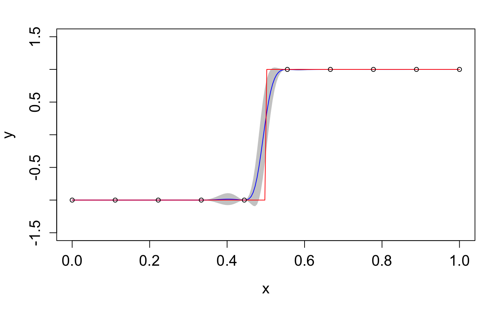

```{r setup, include = FALSE}
knitr::opts_chunk$set(
  echo = TRUE,
  eval = FALSE
)
```

This vignette shows how to use the package to emulate a step function with a three-layered DGP structure.

## 1. Load the package

`dgpsi` in R provides an initialization function `init_py()` that helps you to set up and initialize the required Python environment automatically. We just need to run `init_py()` every time after the package is loaded to initiate the underlying Python environment.

```{r}
library(dgpsi)
init_py()
```

## 2. Set up the step function

We first define the step function:

```{r}
f <- function(x) {
  if (x < 0.5) return(-1)
  if (x >= 0.5) return(1)
}
```

Then we generate ten training data points:

```{r}
X <- as.matrix(seq(0, 1, length = 10))
Y <- as.matrix(sapply(X, f))
```

and 200 testing data points over $[0,1]$:

```{r}
test_x <- as.matrix(seq(0, 1, length = 200))
test_y <- as.matrix(sapply(test_x, f))
```

## 3. Construct the DGP structure

We now build a DGP structure with three layers:

```{r}
layer1 <- c(kernel(length = c(1.0), name = 'sexp'))
layer2 <- c(kernel(length = c(1.0), name = 'sexp'))
layer3 <- c(kernel(length = c(1.0), name = 'sexp', scale_est = TRUE))
all_layer <- combine(layer1, layer2, layer3)
m <- dgp(X, Y, all_layer)
```

Note that each layer is a list that contains one GP node defined by `kernel()` function. In this case we use squared exponential kernel for all GP nodes in every layer with the initial length-scale being unit. By default, the scale (i.e., the prior variance) of a GP node is fixed to 1.0 and we switch on the estimation of scale of the GP node in the final layer that attaches to the output data. We use `combine()` function to combine layers into the DGP hierarchy that is then feeds into `dgp()` to form our DGP object. The key information of constructed DGP structure can be viewed using the `summary()` function:

```{r}
summary(m)
```

```
## +-----------+----------+------------------+-----------------+---------------+-------------------+------------+-------------------+
## | Layer No. | Node No. |       Type       | Length-scale(s) |   Variance    |      Nugget       | Input Dims | Global Connection |
## +-----------+----------+------------------+-----------------+---------------+-------------------+------------+-------------------+
## |  Layer 1  |  Node 1  | GP (Squared-Exp) |     [1.000]     | 1.000 (fixed) | 1.000e-06 (fixed) |    [1]     |        No         |
## |  Layer 2  |  Node 1  | GP (Squared-Exp) |     [1.000]     | 1.000 (fixed) | 1.000e-06 (fixed) |    [1]     |        No         |
## |  Layer 3  |  Node 1  | GP (Squared-Exp) |     [1.000]     |     1.000     | 1.000e-06 (fixed) |    [1]     |        No         |
## +-----------+----------+------------------+-----------------+---------------+-------------------+------------+-------------------+
## 1. 'Input Dims' presents the indices of GP nodes in the feeding layer whose outputs are used as the input to the current GP.
## 2. 'Global Connection' indicates the dimensions (i.e., column numbers) of the global input data that are used as additional input dimensions ## to the current GP.
```

The summary table summarizes key information about the constructed DGP model. Note that we have fixed nugget terms to `1e-6` for all GP nodes because we are emulating deterministic step function (i.e., we would like our emulator to interpolate training data points). The prior variances (i.e., scales) for GP nodes in the first and second layers are fixed to 1 while that for the GP node in the final layer will be estimated (with initial value being 1.0) due to its attachment to the output. For further information about other attributes in the table and how to change the default setting of individual GP nodes, see `?kerenl`.

## Training and prediction

Once the DGP object is constructed, we can train the model using the `train()` function:


```{r}
m_trained <- train(m)
```

```
## Iteration 500: Layer 3: 100%|██████████| 500/500 [00:04<00:00, 109.16it/s]
```

The progress bar displayed shows how long it will takes to finish the training. You are able to change some default settings, e.g., for longer training iterations or to switch off the progress bar. Note that if you want to continue the training for further iterations, you can simply do `m_trained_new <- train(m_trained)` instead of rebuilding the DGP object.

Once the training is finished, we can construct our emulator for predictions:

```{r}
trained_struc=estimate(m_trained)
emu <- emulator(trained_struc)
```

The `estimate()` function extracts the trained structure from the trained DGP object and the structure feeds into `emulator()` to form the emulator object. At this point, you could use `write()` to save the emulator `emu` to a local file and then load it using `read()` next time when you simply would like to make predictions from the emulator.

The following code produces the table that summarizes key information of GP nodes contained in the emulator: 

```{r}
summary(emu)
```

```
## +-----------+----------+------------------+-----------------+---------------+-------------------+------------+-------------------+
## | Layer No. | Node No. |       Type       | Length-scale(s) |   Variance    |      Nugget       | Input Dims | Global Connection |
## +-----------+----------+------------------+-----------------+---------------+-------------------+------------+-------------------+
## |  Layer 1  |  Node 1  | GP (Squared-Exp) |     [0.544]     | 1.000 (fixed) | 1.000e-06 (fixed) |    [1]     |        No         |
## |  Layer 2  |  Node 1  | GP (Squared-Exp) |     [0.890]     | 1.000 (fixed) | 1.000e-06 (fixed) |    [1]     |        No         |
## |  Layer 3  |  Node 1  | GP (Squared-Exp) |     [1.413]     |     0.290     | 1.000e-06 (fixed) |    [1]     |        No         |
## +-----------+----------+------------------+-----------------+---------------+-------------------+------------+-------------------+
## 1. 'Input Dims' presents the indices of GP nodes in the feeding layer whose outputs are used as the input to the current GP.
## 2. 'Global Connection' indicates the dimensions (i.e., column numbers) of the global input data that are used as additional input dimensions to the current GP.
```

Note that the variance (i.e., scale) of the GP node in the final layer and length-scales of all GP nodes have changed due to the training. Once the emulator is ready, it is time to make predictions from it:

```{r}
res <- predict(emu, x = test_x)
```

The `predict()` function returns a named list that gives the posterior predictive means and variances at testing positions. We can extract these information and plot the emulation results to check the predictive performance of our constructed DGP emulator:

```{r}
mu <- res$mean # extract the predictive means 
sd <- sqrt(res$var) # extract the predictive variance and compute the predictive standard deviations
# compute predictive bounds which are two predictive standard deviations above and below the predictive means
up <- mu + 2*sd 
lo <- mu - 2*sd

plot(test_x, mu, type='l',col='blue',xlab='x', cex.axis=1.3,cex.lab=1.3, ylab='y',ylim=c(-1.5,1.5))  # predictive means 
polygon(c(test_x,rev(test_x)),c(up,rev(lo)),col='grey80',border=F) # predictive bounds
lines(test_x,mu,type='l',col='blue')
lines(test_x,test_y,type='l',col='red') # Underlying truth
lines(X,Y,type='p',cex=0.8) # Training data points
```


